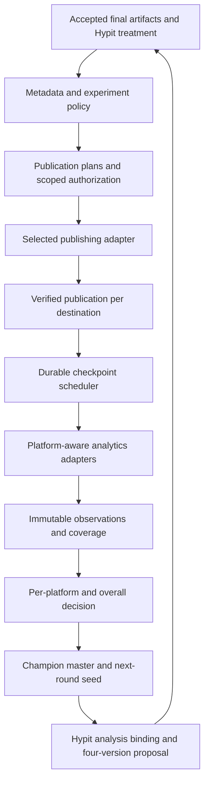

# Four-platform publishing and learning — Kimi K3 development handover

**Status:** implemented offline as of 2026-09-18 (waves W0–W9 plus the REVIEW-2026-09-18 finding patch, 1062 backend + 29 frontend tests green); live provider qualification and real analytics readback remain unqualified — see §14. The independent review (`docs/factory-reports/REVIEW-2026-09-18.md`) verified all 15 findings against this spec; every one was patched and its reproduction probes now assert repaired behavior.  
**Prepared:** 2026-09-18 UTC.  
**Repository:** `/Users/tingsongdai/Kimi-cursor/Short Form AI YouTube`.  
**Inspected checkpoint:** branch `feat/factory`, HEAD `0d4e950`, with substantial uncommitted work. Reinspect before editing.  
**Implementer:** Kimi K3, one sequential builder in the existing codebase.

## 1. Assignment and required outcome

Implement the missing distribution and feedback stages of the Viral Video Factory. A round produces four accepted videos: A is the close adaptation of its seed, B changes the hook, C changes one body factor, and D changes the ending. Publish approved versions to **YouTube Shorts, Instagram Reels, TikTok and Facebook Reels**, capture performance at defined ages, select a defensible champion, and use that champion as the seed for the next round.

The deliverable is integrated backend code, migrations, dashboard flows, durable background work, offline tests, operator documentation and explicit live-qualification evidence. This handover is the implementation brief; the assigned engineer should execute it rather than return another plan.

Success means an operator can complete this journey in the existing interface:

> Accepted Hypit-directed analysis → A/B/C/D production and review → platform-specific metadata → planned and authorized publication → verified post identities → automatic 24-hour observations → provisional decision or wait → next-round seed and four-version proposal → later confirmation.

Four variants on four destinations create **up to sixteen separate publication records**, not four records with a shared timestamp. Each destination may publish at a different time, require different metadata, expose different metrics or fail independently.

The initial provider recommendation is **Upload-Post**, extending the existing adapter. Keep native YouTube analytics for measurement gaps. Other publishers are replaceable adapters, not required subscriptions. The factory database owns the experiment history.

### 1.1 Requirement precedence and scope

This extension updates the older handover's YouTube-first recommendation: the requested interface and contracts now cover all four platforms. It adds 24h and 72h observations alongside the existing 48h/7d/28d views and introduces a distinct mature reporting-window policy. It does not authorize rewriting the production pipeline or weakening its review, spending, delivery or analysis gates.

Keep these boundaries explicit:

- A 24-hour decision is **provisional**; mature evidence can confirm or revise it.
- A can win. Missing evidence, ties and inconclusive outcomes are valid.
- Organic post comparisons are observational; the factory must not claim randomized causal proof.
- A publisher cannot guarantee reach or protection from a “shadow ban.” Publication, public visibility, recommendation eligibility and audience response are separate facts.
- Implement all safe code and offline verification autonomously. Credentials alone do not authorize new spending, subscriptions or public test posts. Apply any existing explicit authorization within its actual scope without asking for it again.
- Preserve the standing finished-video Drive verification and owned-service cleanup rule. Preserve the user's shared factory server and other unrelated processes.

## 2. Entry procedure

Perform these steps in order before changing implementation:

1. Read [repository instructions](</Users/tingsongdai/Kimi-cursor/Short Form AI YouTube/AGENTS.md>), [mission](</Users/tingsongdai/Kimi-cursor/Short Form AI YouTube/GOAL.md>), and [legacy build plan](</Users/tingsongdai/Kimi-cursor/Short Form AI YouTube/BUILD_PLAN.md>). Apply their current factory scope banners; do not restart the completed M1–M12 build.
2. Read the current [factory handover](</Users/tingsongdai/Kimi-cursor/Short Form AI YouTube/docs/viral-video-factory-handover.md>), especially its architecture, authorization and delivery sections, then the [operator guide](</Users/tingsongdai/Kimi-cursor/Short Form AI YouTube/docs/factory-operator-guide.md>).
3. Read the [publishing provider research](</Users/tingsongdai/Kimi-cursor/Short Form AI YouTube/docs/factory-publishing-provider-research.md>) for dated capabilities and the [tool-composition research](</Users/tingsongdai/Kimi-cursor/Short Form AI YouTube/docs/factory-tool-composition-research.md>) for the Hypit/renderer relationship. Recheck official documentation when implementing a provider contract; catalog claims are not live qualification.
4. Inspect branch, diff, untracked files and running processes. Preserve existing edits. The inspected tree already contains changes to analysis, domain records, bootstrap, application transport, worker, dashboard and tests, including a new deep-analysis module. They may continue changing before this assignment starts.
5. Record a fresh offline baseline using the existing test commands. Classify pre-existing failures against the actual working tree; do not revert unrelated work or conceal failures. Never migrate the only production database as a test.
6. Map each proposed change to an existing module or a justified new module at a clear seam. Reuse the SQLite store, artifact registry, effect authorization, command queue, scheduler and dashboard client.

**Entry completion:** record the actual checkpoint, baseline results, preserved concurrent work and affected modules. Start implementation after this local orientation; new approval is not required for authorized code and offline tests.

### 2.1 Repository constraints

The frozen root `schemas/` and `tests/fixtures/` contracts remain frozen. Extend factory-owned records with explicit versions and compatible readers; put new test data in factory-owned test support. A genuinely necessary frozen-contract change remains a separate contract decision.

Keep existing nonempty environment → `.env` → private TOML credential precedence. The user has supplied `TREG_API_KEY` and `MONID_API_KEY` in `.env`; use the existing loader, never display their values. Upload-Post already recognizes `UPLOAD_POST_API_KEY` and `UPLOAD_POST_KEY`. Record credential references and nonsecret account identities only; keep provider tokens out of browser state, artifacts, logs, prompts and URLs.

Factory F-module acceptance and legacy G-gates remain separate. Update the [factory tracker](</Users/tingsongdai/Kimi-cursor/Short Form AI YouTube/docs/viral-video-factory-module-tracker.md>) with scoped evidence; this extension does not sign unrelated gates.

## 3. Current implementation map and confirmed gaps

These are source observations at the checkpoint above, not claims that the current application has passed live acceptance.

| Existing module | Reuse | Required change or verification |
| --- | --- | --- |
| [Publication adapter](</Users/tingsongdai/Kimi-cursor/Short Form AI YouTube/modules/factory/integrations/publisher.py>) | `UploadPostPublisher`, multipart upload, status normalization, stable request identity | Qualify all four platforms, actual returned ID forms, per-platform settings, native visibility and account-scoped verification. Its readiness check alone establishes configuration, not live success. |
| [Publishing module](</Users/tingsongdai/Kimi-cursor/Short Form AI YouTube/modules/factory/publishing/service.py>) | Intent-before-effect, authorization checks, cadence, reconciliation, explicit edits/deletes | Add provider/connection selection; manual platform set currently omits Facebook. Inspect `_apply` and `reconcile`: their fallback to local `now` must not invent actual publication time. |
| [Publication work](</Users/tingsongdai/Kimi-cursor/Short Form AI YouTube/modules/factory/services/publication_work.py>) | Final-byte QC, verified Drive delivery/cleanup, frozen learning policy, worker-bound effect authority | Provider and operation bindings are hardcoded to `upload_post`. Preserve exact-byte checks while generalizing selected routes and immutable metadata. |
| [Configured adapters](</Users/tingsongdai/Kimi-cursor/Short Form AI YouTube/modules/factory/providers/configured.py>) and [bootstrap](</Users/tingsongdai/Kimi-cursor/Short Form AI YouTube/modules/factory/bootstrap.py>) | Live/offline separation, credential loader, configured account identities | Separate publisher readiness from analytics readiness. Construct actual account verifiers and the four-platform analytics router. Keep construction inert offline. |
| [Analytics client](</Users/tingsongdai/Kimi-cursor/Short Form AI YouTube/modules/factory/analytics/client.py>) | Distinct YouTube public statistics, owned analytics and thumbnail-reach routes | Add supported engaged-view queries and preserve current official metric combinations. This client is YouTube-specific; do not pass other platforms' IDs into it. |
| [Readback module](</Users/tingsongdai/Kimi-cursor/Short Form AI YouTube/modules/factory/analytics/service.py>) | Publication-age horizons, immutable observation revisions, raw/normalized evidence | Horizons currently 48h/7d/28d. Add scheduling and 24h/72h; collect engaged views and shares where supported; correct average weighting; distinguish observation age from source coverage. Current completeness can depend on unrelated thumbnail data and exact rolling windows. |
| [Legacy analytics adapter](</Users/tingsongdai/Kimi-cursor/Short Form AI YouTube/modules/factory/analytics/compat.py>) | Explicit export to frozen legacy numeric fields | Its documented null-to-zero conversion must stay at the legacy export edge. Never feed that output back into selection. |
| [Learning module](</Users/tingsongdai/Kimi-cursor/Short Form AI YouTube/modules/factory/learning/service.py>) | Frozen policy, reproducible decisions, supersession relations, evidence-linked hypotheses | `_publication_for` requires exactly one public publication per variant; four-platform posts break that assumption. `_snapshot` selects latest evidence rather than checkpoint-compatible evidence. `no_improvement` leaves winner empty. Independence currently counts seed IDs, which a derived-seed loop could inflate. |
| [Domain records](</Users/tingsongdai/Kimi-cursor/Short Form AI YouTube/modules/factory/domain/records.py>) | `Publication`, `MetricSnapshot`, `DecisionPolicy`, `Decision`, `Hypothesis`, `Seed`, `ExperimentRevision` | Add versioned fields/contracts for connection, metadata, per-platform policies, reporting semantics, lineage and loop authority. Preserve current in-flight edits. |
| [SQLite schema](</Users/tingsongdai/Kimi-cursor/Short Form AI YouTube/modules/factory/store/schema.py>) and [connection management](</Users/tingsongdai/Kimi-cursor/Short Form AI YouTube/modules/factory/store/connection.py>) | Migrations, WAL, foreign keys, newer-database refusal | Schema version was 10 when inspected. Allocate the next unused migration at implementation time; do not assume 11 remains available. |
| [Command queue](</Users/tingsongdai/Kimi-cursor/Short Form AI YouTube/modules/factory/services/commands.py>), [worker](</Users/tingsongdai/Kimi-cursor/Short Form AI YouTube/modules/factory/services/worker.py>), [scheduler](</Users/tingsongdai/Kimi-cursor/Short Form AI YouTube/modules/factory/scheduler/scheduler.py>) | Durable commands, dependencies, lease fencing, reconciliation | Commands exist for publishing, observing, readback and decisions. Add durable due-time scheduling and bounded loop transitions. A browser timer is insufficient. |
| [Application transport](</Users/tingsongdai/Kimi-cursor/Short Form AI YouTube/modules/factory/api/app.py>) and [local security](</Users/tingsongdai/Kimi-cursor/Short Form AI YouTube/modules/factory/api/security.py>) | Idempotency, CSRF, revision checks, loopback-only access, SSE | Extend existing routes. Public provider webhooks cannot reach this loopback application directly; preserve local security and use polling by default. |
| [Operations UI](</Users/tingsongdai/Kimi-cursor/Short Form AI YouTube/apps/factory-dashboard/src/features/operations/OperationsScreen.tsx>), [app](</Users/tingsongdai/Kimi-cursor/Short Form AI YouTube/apps/factory-dashboard/src/App.tsx>), [client](</Users/tingsongdai/Kimi-cursor/Short Form AI YouTube/apps/factory-dashboard/src/api/client.ts>) | Existing Publishing/Learning entry points and request handling | Replace raw operational forms with metadata, schedule, outcome and comparison views. Learning currently defaults to thumbnail CTR/impressions; introduce Shorts-appropriate policies. |
| [Legacy metadata](</Users/tingsongdai/Kimi-cursor/Short Form AI YouTube/modules/publish/metadata.py>) | Existing LLM access and validation patterns | It assumes a faceless YouTube format and appends a CTA. Build a factory-aware metadata workflow without inheriting those assumptions for every seed. |
| [Seed registry](</Users/tingsongdai/Kimi-cursor/Short Form AI YouTube/modules/factory/seeds/registry.py>) | Provenance, deduplication, media attachment | Add an explicit internal-artifact seed path for champions; do not manufacture a fake external URL or depend on URL parsing for a local master. |
| [Deep analysis](</Users/tingsongdai/Kimi-cursor/Short Form AI YouTube/modules/factory/analysis/deep.py>) and [blueprint review](</Users/tingsongdai/Kimi-cursor/Short Form AI YouTube/modules/factory/analysis/review.py>) | In-flight `ReferenceAnalysis`, `analysis_gate`, `bound_gate`, evidence/documents and human review | Integrate with these changes. They are not independently validated by this handover. A new champion seed must retain a valid exact-source analysis binding. |

### 3.1 Exact seams (verified at the inspected checkpoint)

These are the precise places the work must change. Re-verify line numbers against the live tree; the symbols are stable.

| Symbol | Location | Required change |
| --- | --- | --- |
| `LearningService._publication_for(variant)` | `modules/factory/learning/service.py` | Filters `variant_plan_id` + `experiment_revision` + `status=='public'` + `not deleted_at`, returns a record **only when exactly one matches**. Extend the key to `(variant, platform, account)` so 16 publications resolve deterministically; keep the exactly-one-per-slot rule. |
| `LearningService._snapshot(publication_id, horizon)` | `modules/factory/learning/service.py` | Selects `max` by `(observed_at, revision)` — unconditional latest. Replace with eligibility: match the checkpoint definition, `query_version`, `window_kind`, freshness tolerance and required coverage declared by the frozen policy. |
| `LearningService.decide(experiment_id, revision, horizon="", now="")` | `modules/factory/learning/service.py` | Rejects snapshots whose `requested_period.window_kind != 'exact_rolling'` or `horizon_hours != HORIZONS[horizon]` as `incompatible_window`. Widen the accepted `window_kind` set deliberately per policy (`observed_lifetime_at_age`, `source_calendar_window`, `exact_elapsed_window`) — do not bypass the check. Add a `platform` parameter; derive per-platform decision ids `dec-{experiment_id}-r{revision}-{horizon}-{platform}` and keep the existing `-v{N}` supersession chain (`_decision_chain`). |
| `LearningService.freeze_policy(...)` | `modules/factory/learning/service.py` | Validates `horizon ∈ HORIZONS`, `primary_metric`/`exposure_metric ∈ NORMALIZED` minus `public_views`. New horizons (`24h`, `72h`) and any new normalized metrics must be registered in those maps or freeze legitimately rejects them. It also refuses policy changes once any non-failed publication exists for the revision — freeze the complete cross-platform policy before first dispatch. |
| `LearningService.independent_experiments(template_ref)` | `modules/factory/learning/service.py` | Collects distinct `seed_id`s. Derived Round-2 seeds are different ids from the same material — count by lineage root (`lineage_root_id or seed_id`) once §5 lineage fields exist. |
| `HORIZONS`, `NORMALIZED`, `QUERY_VERSION`, `ReadbackService.collect` | `modules/factory/analytics/service.py` | `HORIZONS = {"48h":48, "7d":168, "28d":672}` — add `24h`/`72h` and the complete-days window key. `NORMALIZED` maps normalized names to YouTube Analytics columns — introduce per-platform metric maps feeding the same snapshot shape; do not bend YouTube column names onto other platforms. Keep `missing ≠ zero`, `attempts` reuse and `raw` preservation. |
| Worker command dispatch | `modules/factory/services/worker.py` (~line 94) | Commands are `publish` → `publication_work.execute`, `publication_observe` → `publishing.reconcile`, `readback` → `readback.collect(publication_id, horizon)`, `decision` → `learning.decide(experiment_id, revision)`. Extend `decision` with `horizon`/`platform` and add a `select_seed` command for the champion transition. |
| `connections.json` `publish` slot | `modules/factory/providers/configured.py` (~line 111) | Already read as `{user, accounts}` → `extra['publication_accounts']`. Keep that shape; extend `accounts` entries to carry `{platform, account_id, page_id?, capabilities, qualified_until, contract_evidence, live_evidence}` so destinations resolve by stable identity, not display name. |
| Host allowlist | `modules/factory/api/security.py` | Only loopback/testserver hosts pass; a real provider webhook receives `403 bad_host`. §7.3 polling is the required path; any later signed receiver needs its own narrowly-scoped ingress, not a weakened allowlist. |

## 4. Target architecture and provider selection



Keep a small application-facing interface for publication planning/execution, measurement and next-round creation. Hide provider-specific upload/container logic inside adapters. Production code, UI and learning code should consume normalized records rather than branch repeatedly on provider names.

### 4.1 Required first implementation

- Upload-Post publication, scheduling/reconciliation and supported per-post analytics for all four platforms.
- Native owned-channel YouTube measurement for required fields not supplied by the publisher.
- Local durable storage, due jobs, selection and next-round lineage.
- Readiness/capability display for each account, operation and metric. An unavailable credential must be distinguishable from unsupported functionality and failed qualification.
- Offline fakes behind the same interfaces as live adapters.

### 4.2 Optional routes, with explicit qualification

Treg can provide direct own-account publication and insights. The research found YouTube upload, TikTok publish initialization, Instagram container/publish and Facebook video routes. All four access checks returned no connected credentials in the user's Treg organization. A Treg API key does not replace social-account consent or posting scopes. Qualify exact operations, not a whole provider by name.

Monid discovery found useful data candidates but no verified publisher covering the required four networks. Use it for a justified data gap after verifying schema, meaning, cost and access. Its catalog names do not establish private account analytics.

Ayrshare is an optional richer-analytics alternative. Blotato's analytics question is **resolved by direct evidence**: the user's connected Blotato MCP exposes `blotato_get_post_analytics` and `blotato_list_top_posts`, and their own tool descriptions state analytics are collected for "Twitter/X, Instagram, Facebook, Threads, and Bluesky" with "other platforms return no metrics yet" — **no YouTube and no TikTok**. Blotato can publish to all four targets but cannot supply measurements for the two platforms that carry this experiment; treat it as an optional publisher adapter only, never the sole analytics source. Neither alternative is required to finish the initial implementation. Preserve replaceability without implementing speculative adapters or presenting placeholders as ready.

Current prices, quota tiers, field coverage and documentation conflicts live in the research note; do not embed prices as permanent application constants. A quote must carry its observation date, units, plan/account and uncertainty.

## 5. Domain contracts and storage

Extend existing records where that preserves their meaning. Introduce a new factory version when semantics change. The names below are conceptual contracts; avoid creating redundant representations of the same fact.

| Contract | Required information and invariants |
| --- | --- |
| Social connection | Stable connection ID; provider; platform; native account/channel/Page ID; nonsecret credential reference; account type; granted operations; expiry/last verification; capability and qualification evidence. One connection identity is not a display handle. |
| Metadata package | ID/revision; experiment/variant scope; final artifact ID/hash; analysis/treatment bindings; platform/account; candidate set; selected candidate; provider/model/prompt version; validation results; reviewer/selection rationale; immutable selected fields and content hash. |
| Publication plan/record | Existing final-byte and review references plus connection/provider, metadata revision/hash, format (`short`, `reel`, etc.), schedule/timezone, operation request hash, authorization, stable dispatch identity, remote IDs by their actual type, verified native post ID/URL, visibility and actual-time evidence. |
| Checkpoint schedule | Publication ID; checkpoint definition/version; due time; window kind; next eligible retry; status/attempts; unique logical collection key; query version; policy reference. Elapsed age and source-calendar windows are separate fields. |
| Metric observation | Publication/platform/account/post identity; immutable observation ID/revision; scheduled and actual observation times; provider freshness; raw artifact hash; metrics and per-metric availability; units/denominators; requested and actual coverage; source/query version. |
| Evaluation policy | Frozen destinations and weights; fast and mature objectives; source priorities; checkpoint/window rules; age/freshness tolerances; minimum exposure; practical-lift and guardrail rules; missing-data/tie behavior; declared metadata treatment. |
| Decision | Policy hash; experiment revision; exact observation IDs/revisions/hashes; per-platform outcomes; aggregate method/version and scores; selected variant if justified; conclusion and maturity; limitations; reproducible input hash; supersession relation. |
| Round lineage | Series ID; round number; parent experiment/revision; parent decision/revision; champion variant/artifact/edit-plan references; new internal seed ID; original reference; **independence group/root-material identity**. |
| Loop policy/run | Allowed series/accounts/providers; production and publication scope; maximum rounds and posts; spend caps by unit; expiry; stop conditions; review requirements; fast/mature advancement rule; state and current transition identity. |

### 5.1 Identity and revision rules

- Native post IDs are scoped by platform and account. The same string on two networks is not the same post.
- A publication belongs to one exact variant revision and destination. Revisions of the same publication record are not additional posts.
- Select current eligible publication revisions by `(experiment revision, variant, platform, account)`. Handle an explicitly recorded replacement/deletion; never choose an arbitrary latest row.
- A metadata or media change produces a new approved plan revision. Pending jobs must verify the binding again immediately before dispatch. Already-published metadata changes are separate authorized effects and must annotate the experiment's comparison validity.
- **Two CAS handles exist — do not conflate them.** `revision` inside a record body is the record's version identity (a new revision row per mutation — how `ExperimentRevision` and friends CAS). The `records` table's `version` column is the optimistic lock for records mutated in place at a stable revision (e.g. `MetadataPackage`). `X-Expected-Revision` for in-place mutations must carry the row `version`; collection and detail responses expose it as `version` so clients can send it back. A client that echoes `body['revision']` will be correctly rejected as stale.
- One checkpoint has one logical schedule but can have several immutable observation revisions. An identical retried command returns its existing result; a genuinely later collection can append evidence. Neither is another independent experimental sample.
- A decision binds exact evidence, not whatever a “latest” query returns tomorrow.
- A new seed ID for Round 2 does **not** make the underlying material independent. Preserve the independence group across derived rounds and record manual grouping decisions for duplicate/reused source material.
- All four accepted masters and their editable plans remain retained while any series references them. Preview cleanup must not delete lineage evidence.

### 5.2 Migration and compatibility

Use the existing SQLite store and artifact registry. Add indexed due-time data through a migration or an equivalent durable table; avoid scanning unbounded JSON history every worker tick. Add uniqueness constraints for publication destination slots, checkpoint identities and next-round transitions where practical.

Migrate old records conservatively: provider can be mapped to Upload-Post only where provenance establishes it; unsupported connection details and timestamp certainty stay unknown. Old snapshots retain their old metric definitions and window labels. An old `7d` record must not become “seven complete reporting days” by renaming it.

Keep legacy exports separate and versioned. Test migration on a copy, interrupted migration recovery, backup/restore and older-binary refusal. Use established restore/reconciliation rules for unresolved external effects; restoring a database is not permission to repeat uploads.

### 5.3 Proposed record shapes (verify against `records.py` conventions before committing)

The table in §5 is contractual; the sketches below give K3 concrete starting points. Match existing record conventions (`Record` base, `kind`, `validate()`, `to_dict()`/`from_dict()`, content hashes) and adjust names if a better fit already exists.

```python
@dataclass
class MetadataPackage(Record):            # kind 'metadatapackage'
    variant_plan_id: str = ""             # one package per (variant, platform)
    final_sha256: str = ""                # bound to exact accepted export
    platform: str = ""                    # youtube|tiktok|instagram|facebook
    revision: int = 0                     # stable identity — CAS uses the records row `version`
    status: str = "draft"                 # draft|frozen|superseded
    candidates: list = field(default_factory=list)   # [{id, via, fields{...}, notes}]
    selected: dict = field(default_factory=dict)     # chosen platform-mapped field set
    disclosures: dict = field(default_factory=dict)  # ai_content, branded, audience
    generator: dict = field(default_factory=dict)    # {route, model, prompt_version, evidence_id}
    validation: dict = field(default_factory=dict)   # {ok, errors[], checked_fields[]}
    content_hash: str = ""
```

```python
@dataclass
class SeedSelection(Record):              # kind 'seedselection' — one per (experiment_rev, checkpoint)
    experiment_id: str = ""
    experiment_revision: int = 0
    horizon: str = ""                     # '24h' provisional | '7d_complete' mature | ...
    status: str = "provisional"           # provisional|confirmed|inconclusive|superseded
    winner_variant: str = ""              # 'A'|'B'|'C'|'D' — A is legal
    publication_id: str = ""              # evidence post for the winning variant
    artifact_id: str = ""                 # winning ORIGINAL master artifact (not social copy)
    basis: dict = field(default_factory=dict)        # per-platform ranks/scores + policy hash
    decision_ids: list = field(default_factory=list) # per-platform decisions consumed
    seed_id: str = ""                     # created Round-2 seed id (set on transition)
    content_hash: str = ""
```

```python
@dataclass
class RoundLineage(Record):               # kind 'roundlineage' — or additive fields on Seed
    series_id: str = ""
    round: int = 0
    parent_experiment_id: str = ""
    parent_experiment_revision: int = 0
    parent_selection_id: str = ""         # SeedSelection that produced this seed
    seed_id: str = ""
    root_reference_id: str = ""           # ORIGINAL external reference seed
    independence_group: str = ""          # root-material identity — constant across derived rounds
```

For `Seed` itself, prefer additive fields (`parent_seed_id`, `lineage_root_id`, `round`, `independence_group`) over a side record when the factory already queries seeds by id; either way, `independent_experiments` must count `independence_group or lineage_root_id or seed_id` — never the raw derived id.

`DecisionPolicy` gains a frozen `seed_policy` dict, frozen in the same `freeze_policy` call:

```python
seed_policy = {
  "mode": "weighted_rank",                # or "primary_platform"
  "primary_platform": "youtube",          # when mode == primary_platform
  "weights": {"youtube": .25, "tiktok": .25, "instagram": .25, "facebook": .25},
  "min_margin": 5.0,                      # aggregate-score margin; below → inconclusive
  "provisional_horizon": "24h",
  "mature_horizon": "7d_complete",
  "per_platform": {                       # each entry feeds the platform decide() call
    "youtube":   {"primary_metric": "views", "min_exposure": 100, "guardrails": {...}},
    "tiktok":    {"primary_metric": "views", "min_exposure": 100, "guardrails": {...}},
    "instagram": {"primary_metric": "views", "min_exposure": 100, "guardrails": {...}},
    "facebook":  {"primary_metric": "views", "min_exposure": 100, "guardrails": {...}},
  },
}
```

A `socialconnection` record is optional; if `connections.json`'s `publish.accounts` entries carry platform/account_id/page_id/capabilities/evidence, that file plus the capability system may satisfy the connection contract without a new record kind.

## 6. Metadata production and experiment integrity

The input is the **accepted final video and its creative evidence**, not merely its seed title. Use the final transcript/action descriptions, actual payoff, audience, language, brand context and allowed claims.

Implement this sequence:

1. Generate a bounded set of candidate packages for each destination; default three candidates is sufficient. Reuse the existing qualified LLM route and record model/prompt/version/cost. Optional Upload-Post analysis must use its declared allowance and funding route.
2. Validate factual consistency, promise/payoff match, language, platform field limits, relevant hashtags, cover support and required audience/disclosure settings. Candidate scoring is a creative judgment, not measured viral performance.
3. Show the selected candidate and alternatives with editable fields. Preserve validation and an explanation of the choice. A required audience or commercial-disclosure field with insufficient evidence needs an explicit configured answer, not an invented default.
4. Freeze the selected package into the publication plan. Any material edit invalidates affected authorization and comparison bindings.

Support platform-specific title/description/caption fields and relevant cover/thumbnail controls only when the selected route supports them. Instagram/TikTok caption mapping must follow the provider's actual contract. Do not silently pass everything as `description`. Facebook must resolve a specific Page.

Within each platform, use the same metadata across A/B/C/D for a video-only experiment wherever the text remains truthful. Different platforms can use different text. If B's content requires a different promise, record a combined package treatment; do not claim its result isolates the video edit. Dedicated title/cover/caption experiments are a separate declared mode.

Keep tone and CTA appropriate to the reference format. The legacy metadata module's faceless-channel assumption and unconditional CTA must not become universal defaults. Hashtag quantity is not an optimization objective. Required synthetic-content or commercial disclosures must not be removed to chase reach.

**Completion:** each planned destination has a validated, versioned selected package bound to the actual export, and changed metadata cannot silently pass an old publishing approval.

## 7. Publication lifecycle and operational guarantees

### 7.1 State and verification

Normalize provider outcomes into a clearly documented lifecycle compatible with existing records:

`planned → authorized → submitting → accepted/processing/scheduled → public_verified`

Also support `draft`, `failed`, `unknown`, `needs_reconnect`, `cancel_requested` and reconciled cancellation/deletion where appropriate. Map to existing enum values or version the contract deliberately; do not write new states that old validators reject.

Submission success is not public success. Verify destination identity, native post ID, expected format, visibility, URL and publication time from the provider or native platform. Preserve provenance for that verification. A scheduled time, upload acknowledgement or reconciliation time cannot substitute for actual public time.

When exact publication time is unavailable, store first-seen-public time and any bounds separately. Either block age-sensitive comparisons or use an explicitly allowed estimated-time policy. Never silently assign `now` as exact publication time.

### 7.2 Dispatch, recovery and cadence

Persist intent and authorization before network dispatch. Use the documented idempotency mechanism with stable identities across retries. Upload-Post's correlation `external_id` is not a substitute for idempotency. Normalize each documented request/job/container/video ID by type and resolve it to the final native post ID.

On timeout or lost acknowledgement, reconcile the original provider operation. Switch publisher only after no external effect is established and the alternate route is authorized. A fallback must not double-post the same destination.

Track partial success per destination. If YouTube succeeds and Instagram fails, retry only the unresolved/failed Instagram operation when safe. Preserve successful siblings and their true clocks.

Apply per-account/platform cadence in its configured timezone, including daylight-saving transitions. The current default of two posts per day is an operational setting, not a guaranteed reach threshold; do not silently increase it to fit four variants. Plan slots across days if required, preserving comparable post-age checkpoints and recording slot/order differences.

Do not count repeated observer requests as new uploads or reserve another publishing slot. On a cancelled series, preserve already-public posts and continue authorized reconciliation/observation; cancellation does not imply deletion.

### 7.3 Local deployment and webhooks

The current application accepts loopback hosts and CSRF-protected mutations. Use worker-driven provider polling/history reconciliation as the default local deployment. This must work while the browser is closed.

Webhooks are optional accelerators. If enabled later, use a separately configured reachable receiver, signature/timestamp verification, replay deduplication, bounded payloads and durable forwarding. Do not expose the whole local application or remove CSRF/Host protection to receive provider callbacks. Webhook loss must be recoverable through polling.

### 7.4 Eligibility status

Expose connection health, public visibility and documented platform restriction/recommendation signals separately from performance. Unsupported signals are unknown. Where necessary, allow an attributed native-Studio check with timestamp and evidence. Low views alone must never create a `shadow_banned` fact.

Keep experiments original and bounded. A close mimic adapts the format using accepted material; technical mutations designed to disguise duplicate content are outside the workflow. Schedule quality experiments rather than an unlimited stream of minimally changed reuploads.

## 8. Analytics semantics and collection

### 8.1 Two measurement modes

| Mode | Meaning | Valid uses |
| --- | --- | --- |
| `observed_lifetime_at_age` | Cumulative counters fetched around a scheduled age, with actual observation time and upstream freshness | Provisional 24h/48h/72h ranking when timing and freshness meet the frozen policy. It is not an exact event-time count. |
| `source_calendar_window` | Metrics supplied for explicit completed reporting dates in the source timezone | Mature evaluation using comparable complete dates; retains source-day boundaries and actual completeness. |
| `exact_elapsed_window` | A source explicitly supplies the requested elapsed interval | Only supported adapters/evidence may use this label. Never infer it from date-only inputs. |

Keep collection time, post age, upstream update time and event coverage separate. A fetch at hour 24 can contain counters last updated at hour 18. A fresh HTTP response does not prove fresh underlying data.

### 8.2 Scheduling rules

- Create durable due entries only after a publication has verified public identity and usable time evidence.
- Schedule 24h, 48h, 72h, 7d and 28d observation checkpoints from **each** destination's actual time. Use UTC instants for elapsed delays; use an IANA timezone for calendar policies.
- For the mature default, evaluate seven **complete source reporting days**. Exclude a partial publication day; include the publication day if it begins exactly at the source-day boundary. Compute the next seven calendar dates in the source timezone, not a fixed 168-hour substitute across DST. Query once eligible and retry until required data are processed.
- **Gate mature policies on measurement capability.** Before `freeze_policy` accepts a policy requiring `source_calendar_window` for a destination, the per-destination capability matrix (§8.3) must show a qualified source supplying that window kind. Upload-Post's cached analytics select *when metrics were captured*, not *when views occurred* — the publisher cache alone does not establish a reporting window on any platform; native YouTube Analytics can supply source reporting dates for YouTube destinations only. A freeze that would require an unsupplied window must fail `window_capability_missing`, naming the destinations and the missing source — never freeze a permanently-unusable mature policy.
- When no reporting-window source can be qualified for a required platform, the operator may explicitly approve a differently-labeled mature policy — e.g. `observed_lifetime_at_age` at the 7d/28d checkpoint with a declared freshness tolerance — and the policy records that label and its limitation. The label is part of the decision evidence; a lifetime-at-age evaluation must never be presented as seven complete reporting days.
- Distinguish the legacy elapsed `7d` checkpoint from the new complete-days window in IDs, labels and policy. Both can be displayed without pretending they have the same coverage.
- Inject the clock into scheduling, collection and selection. Persist `next_attempt_at`, bounded backoff and final retry/expiry outcomes. Do not hold a worker lease asleep for 24 hours.
- On restart or laptop wake, enqueue due work idempotently. A missed 24h snapshot cannot be reconstructed from a current lifetime count; mark it late/missed and retain later evidence honestly.
- Use required metric readiness to decide whether a checkpoint is usable. Missing optional thumbnail reach must not prevent a valid Shorts comparison.
- Keep scheduling independent of dashboard refresh. Worker sleep/offline status and missed checkpoint effects must be visible.

### 8.3 Metric profiles

Implement a capability matrix per platform/account/route with native names, normalized names, units, denominator, window types, freshness, retention limits and whether the field is required by the selected policy.

Collect views, likes, comments and shares when supplied; add saves, engaged views, viewing-duration/percentage metrics, retention and attributable follower/subscriber outcomes where supported. Missing is null with a reason. Do not replace unavailable post shares with account-level shares or public counts with private retention.

For YouTube:

- Add supported `engagedViews` and sharing metrics to the appropriate query/normalization paths.
- Retain public Data API counters as lifetime observations with their own definition.
- Use correct Shorts denominators for viewing averages. Prefer a provider aggregate for the exact requested window, or weight daily averages by the matching engaged-view denominator. Do not average averages equally or use public playback starts as a substitute.
- Preserve thumbnail impressions/CTR as separate optional metrics rather than the default Shorts-feed objective.
- Stayed-to-watch requires a verified source; `engagedViews / views` is not that metric.
- Preserve valid retention/percentage values above one/100%; they do not independently prove a particular replay rate.

For Instagram, TikTok and Facebook, preserve differences between plays, views, reach, watch time, completion, shares and saves. Validate whether completion is a fraction or percentage. A publisher's convenient alias must not erase the native meaning. Account-level dashboards are not per-post evidence.

Store comments **counts** by default. If comment text is later used for qualitative analysis, make that a separate bounded collection purpose; label themes as hypotheses and do not automatically reply or send messages.

### 8.4 Observation selection

Replace unconditional latest-snapshot selection with policy-aware eligibility. Select by publication identity, checkpoint definition, query/source version, actual post-age/freshness tolerance and required coverage. A 72-hour lifetime observation cannot replace a missing 24-hour one because it is newer.

Backfilled source-window data can produce a new decision revision; an old decision retains its original evidence. Provider cache replay can be logged but cannot manufacture another sample or apparent performance improvement.

## 9. Decision policy and champion selection

### 9.1 Freeze before publication planning

The policy must identify destinations/accounts, primary metrics per platform, source priority, required metrics, tolerances, exposure thresholds, practical improvement and guardrails. UI defaults may be suggested, but the stored policy must make every decision-relevant choice explicit.

Provide two profiles:

- **Fast iteration:** 24-hour observations, using a consistent supported views definition within each platform plus declared engagement/quality guardrails. Output is provisional. Delayed optional retention cannot silently become zero or change the ranking formula.
- **Mature confirmation:** complete reporting-window evidence, with YouTube engaged views where available and qualified platform-specific objectives elsewhere. Confirm/revise the candidate while preserving historical decisions.

Use the user's approved thresholds or channel evidence; do not present a universal minimum-view number as statistically sufficient. Once frozen, missing required signals cause waiting/inconclusive, not automatic metric substitution. A later policy change is a distinct revision with its implications recorded.

### 9.2 Per-platform comparison

For each required platform/account, resolve one eligible public post per A/B/C/D. All four must have comparable evidence before that platform contributes to the round decision. Detect duplicate destination mapping, deleted/replaced posts, mixed experiment revisions, metadata changes during observation, missing publication and incompatible windows.

Evaluate A's guardrails as well as B/C/D. Calculate treatment lift against A when meaningful; if A's denominator is zero, relative lift is undefined. Support a separately declared absolute-gain rule or return inconclusive—never infinite lift.

Use explicit outcomes such as `waiting_for_data`, `insufficient_exposure`, `invalid_comparison`, `inconclusive`, `retain_control`, `provisional_winner` and mature confirmation. Version existing enum semantics. A no-improvement result with adequate evidence can explicitly retain A; it must not be mistaken for missing data.

Keep the two questions separate:

- **`decide(experiment_id, revision, platform, horizon)`** answers "did any variation beat the control on this platform at this checkpoint?" — control-relative, one `Decision` per `(experiment revision, platform, horizon)` with ids `dec-{id}-r{rev}-{horizon}-{platform}` and the existing `-v{N}` supersession chain.
- **`select_seed(experiment_id, revision, horizon)`** answers "which of the four becomes Round 2's seed at this checkpoint?" — a best-of-4 ranking across the frozen platforms where **A is a legal winner**. Produce a `SeedSelection` (§5.3), not a `Decision` with `winner` overloaded; a platform decision may conclude `retain_control` while seed selection still legitimately chooses A's master as the next seed.
- **Separate selection evaluation from child creation.** A `SeedSelection` evaluation is keyed by `(experiment_id, revision, horizon)` and carries an `inputs_hash` over the consumed decision ids, the policy hash and the evidence revisions. Retrying the command with unchanged inputs returns the existing evaluation — that is idempotency. A different horizon, a revised policy or superseded evidence produces a **new evaluation revision** (`sel-{exp}-r{rev}-{horizon}-v{N}`) which may reach a different conclusion; superseded evaluations keep their evidence. Status flow: `waiting` (insufficient coverage) → `provisional` (e.g. the 24h evaluation satisfies its requirements) → `confirmed` or `revised` (the mature evaluation agrees or disagrees) — and `inconclusive` is terminal for that evaluation, not for the series.
- Child creation is a distinct step keyed to `(series, parent experiment revision)` with at most one active child (§10). A revised mature selection must not silently create a competing child or repoint an existing one — the child records the evaluation id it was created from, and a revision produces a new proposal rather than mutating history.

### 9.3 One overall seed across four platforms

Support a designated primary platform and a fixed weighted aggregation. Default the proposed four-platform profile to equal weights only when all four are required and have comparable data. Surface per-platform winners even when selecting one overall champion.

A transparent initial aggregation is **within-platform rank**, recommended for broad consistency rather than total reach. The evaluation order is fixed so two implementations produce the same champion from identical evidence:

1. **Per-platform validity.** Resolve each required platform's comparison as in §9.2. A required platform with incomplete evidence → the evaluation waits (`waiting`). A platform where **the control fails its own guardrail** → `invalid_comparison` for that platform with reason `control_guardrail_failure`; an invalid required platform makes the evaluation `inconclusive`, not "wait" — evidence is complete, the comparison is unsafe.
2. **Per-variant eligibility.** A variant is eligible iff it passes exposure and guardrails on **every** required platform that produced a valid comparison. Guardrails are safety floors, not ranking inputs: failing any required platform disqualifies the variant globally.
3. **Per-platform ranks.** Rank all four variants on each valid platform by the frozen primary metric; highest is rank 1, average ranks for exact ties. Ineligible variants still receive ranks — the rank is evidence — but are marked ineligible and cannot win.
4. **Aggregate score.** `100 × (4 - rank) / 3` per platform, then the weighted mean with frozen weights summing to one. An ineligible variant's score is computed for display only.
5. **Winner evaluation in score order.** Consider eligible variants from highest aggregate score down. A challenger passes iff (a) its aggregate score leads the next eligible contender by at least `min_margin`, and (b) it satisfies the frozen `improvement_rule` against A — `seed_policy` declares one of `weighted_lift` (Σ weight_p × relative lift_p ≥ `practical_lift`, where relative lift uses a declared denominator floor so a zero-exposure A yields `insufficient_exposure`, never infinity) or `min_platforms` (beats A's primary metric by `practical_lift` on ≥ K named required platforms). If the top scorer fails, evaluate the next eligible scorer under the same rule.
6. **Outcomes.** First passer → `winner` (`provisional` at the provisional horizon). No challenger passes → `retain_control` when A is itself eligible and evidence is adequate. A ineligible → `inconclusive` — never silently retain a control that failed a guardrail. An exact aggregate-score tie for the lead → `inconclusive`; never break ties by letter order.

Worked cases (encode as acceptance tests; use equal weights and `min_platforms=2`, `practical_lift=10%`):

| Case | Evidence | Required result |
| --- | --- | --- |
| Disqualified top scorer | B tops the aggregate but fails the Instagram guardrail; C is next highest and passes every gate | **C wins** — ineligibility is global, not per-platform |
| Mixed-platform improvement | B beats A on YouTube and TikTok, ties on Instagram, loses on Facebook | **B passes** — `min_platforms` counts platforms beaten, not unanimity |
| Unsafe control | A fails a guardrail on TikTok; B is the top scorer elsewhere | `invalid_comparison` on TikTok → evaluation `inconclusive`; do not crown B on the remaining platforms and do not retain A |
| No challenger clears improvement | C tops the aggregate but fails `weighted_lift`; A is eligible | `retain_control` — a real outcome, not missing data |
| Zero-exposure control | A has zero views on YouTube; B has 5,000 | `insufficient_exposure` for that platform's lift — never infinite lift; if `min_platforms` still passes elsewhere, B can win on the declared rule |

This is descriptive ranking, not a probability of winning or a significance test. It discards magnitude: expose the underlying counts and lifts. Do not pool raw cross-platform views. If a required platform is missing evidence (missing, not invalid), wait; do not renormalize weights silently. Any alternate aggregation must have a version, documented rationale and offline numeric examples before activation.

If A is selected or challengers fail the declared improvement criteria, retain A only when A is eligible and the evidence is adequate. The UI may propose another round from A without claiming an improvement. If evidence is inadequate, do not advance automatically.

## 10. Round 2 and bounded continuation

Create a single next-round transition keyed to the series, parent experiment revision and decision revision. Two workers or repeated clicks must not create two children. Also ensure at most one active child per parent unless an explicit fork is requested; a revised decision must not silently create a competing series branch.

The selected **original local master** becomes the new internal seed, with its artifact hash, editable composition, accepted analysis, metadata and observation evidence. Avoid a recompressed download from the social platform while that master exists.

Source provenance and analysis rules:

- Store `parent_seed_id`, `root_reference_id` and an independence/material group, not just a newly generated seed ID.
- Reuse evidence only when its media hash, timing and meaning still apply. A blueprint for the external reference is not automatically an analysis of our edited champion.
- Run or complete Hypit-directed analysis for the champion's exact bytes and new role as the reference. Bind it through the current acceptance machinery.
- The in-flight deep-analysis implementation requires human review. The loop must show `awaiting_analysis_review` when that requirement is unmet; auto-seeding is not authority to forge review evidence or weaken the gate.
- Create the next A from the new seed's accepted recipe, then branch B/C/D independently using evidence-linked hypotheses. Reuse unchanged qualified assets where appropriate. Keep the first round's A as historical evidence rather than relabeling it as the next control.
- Derived rounds within the same material family count as one independence group for transferable-format promotion. New IDs, later observations and publication on four networks do not create independence.

Provide an explicit loop policy with modes `propose_only` and `execute_within_authorization`. The default without recorded continuation authority is a reviewable next-round proposal. A funded, scoped policy may continue automatically through permitted operations without repeated prompts. It must still obey exact-artifact publication approval or an existing compatible standing publication policy; never turn a planning preference into blanket authority.

Bound round count, total/per-round spend by native unit, permitted accounts/providers, post count, expiry and stopping rules. Stop new effects on revoked authority, exhausted budget, invalid analysis, failed QC, unresolved external submissions, missing required data, or repeated lack of improvement as configured. Continue necessary observation/reconciliation of accepted work according to the existing pause semantics.

Distinguish local control states from remotely scheduled provider jobs. A local stop is **not** a remote cancellation, and the interface must never imply one:

| Operator action | Effect on local work | Effect on provider-scheduled posts |
| --- | --- | --- |
| `pause` | Stops new dispatch and observation scheduling; in-flight leases finish | **None.** Remotely scheduled posts still go live at their slot. Dashboard shows `scheduled_remote — will publish unless cancelled`. |
| `series_cancel` | Stops new work for the series | Enumerates still-scheduled remote submissions and issues the provider's scheduled-job cancellation per destination (Upload-Post exposes a distinct cancel operation — use it; deleting the local record cancels nothing remotely). Per-job outcome recorded: `cancelled`, `already_public` (lost the race — reconcile to public; never report cancelled), `cancel_failed` (bounded retries then an explicit operator action), `unknown`. |
| `authority_revoked` / stop-condition hit | Stops new authorized effects immediately | Does **not** auto-cancel remote schedules — cancellation is itself an external effect requiring explicit operator confirmation. Outstanding `scheduled_remote` jobs are listed prominently with a cancel affordance. |

Cancellation races are normal: a slot may go live between the status check and the cancel call. Reconcile after cancelling and store the true outcome; an already-public post continues authorized observation per §8. A failed or impossible remote cancel is `cancel_failed`, not `cancelled`.

If mature data later revise the champion, preserve a Round 2 already produced or published. Mark its basis as superseded; do not delete posts or generate a replacement automatically. Cancel unstarted work only according to the recorded policy and create an explicit next decision/proposal.

## 11. Application interface and dashboard

Extend the existing transport and command queue. Endpoint names below are proposed additions; inspect existing routes before creating equivalents.

| Journey | Interface behavior |
| --- | --- |
| Connections | Read configured destinations and capability evidence; request an explicit readiness refresh; provide supported provider-hosted connection instructions. Credentials remain server-side. |
| Metadata | Queue generation against accepted final artifacts; read candidates; select/edit through revision-checked mutations; validate/freeze a package. |
| Publication | Extend existing variant-publication planning, authorization, run and observe routes with selected connection and metadata identity. Support a batch plan with distinct per-destination children. |
| Metrics | Extend existing publication-readback routes with checkpoint definitions; read schedules and immutable observations; request a bounded refresh without changing history. |
| Learning | Extend existing experiment-policy/decision routes with platform policies and evidence views. Show fast and mature outcomes separately. |
| Next round | Add a revision-checked command to propose the next seed/round from a decision; return its existing transition on retry. |
| Loop control | Configure and authorize bounded continuation separately; inspect state; pause/resume/stop new work through existing scheduler semantics. |

All mutations retain idempotency, CSRF and expected-revision behavior. Long work returns durable job identities. Read-only result screens should not trigger paid analysis or publication. Events must carry safe status information without exposing tokens or signed media URLs.

Split new UI into focused features as needed rather than expanding the current generic operations component indefinitely. Preserve current tabs and analysis edits. Required user-facing views:

1. **Accounts:** four platforms, destination names, actual account type, connection/permission/qualification state and clear next action.
2. **Prepare posts:** A/B/C/D previews, platform tabs, metadata candidates, disclosure/cover support and a preview of exactly what will publish.
3. **Schedule and publish:** all planned destinations, local timezone slots, policy/budget summary, approval state, individual results and safe retry controls.
4. **Performance:** A/B/C/D comparison by platform/checkpoint, counts plus definitions, actual age, freshness, missing-data reason, and provisional/mature labels.
5. **Next round:** chosen champion, explanation, per-platform disagreement, new hypotheses, analysis/review requirements and lineage.

Use plain language such as “Waiting for TikTok's latest statistics,” “Observed 27 hours after posting,” and “A remains the control.” Raw JSON may be an optional diagnostic view, not the required user workflow.

## 12. Sequential implementation packages

Use `PL-00` through `PL-08` as extension work IDs. They supplement existing F-module records and must not overwrite historical acceptance.

| Package | Build scope | Completion criterion |
| --- | --- | --- |
| PL-00 — Baseline | Orientation, current diff, fresh tests, module mapping, preservation of in-flight analysis | Written checkpoint and evidence; no unrelated changes lost. |
| PL-01 — Contracts | Versioned connections, metadata bindings, checkpoint semantics, decision/lineage/loop records, migrations | Old data readable without invented facts; migration/validation tests pass; root-material independence survives round creation. |
| PL-02 — Metadata | Evidence-grounded candidates, platform validators, selection, immutable package binding | Four-platform package can be generated/edited/frozen offline; old approval rejects changed text/media. |
| PL-03 — Publication | Upload-Post four-platform adapter, account verification, destination identities, scheduling/recovery | Scripted transport covers four destinations, partial success, lost ack, required fields and actual-time evidence; existing final/review/delivery gates remain effective. |
| PL-04 — Measurement | Analytics router, corrected YouTube definitions, publisher adapters, snapshots and due jobs | 16 distinct posts can produce honest scheduled observations; missing/cached/late data and restart behavior are tested. |
| PL-05 — Selection | Per-platform selection, fast/mature policies, aggregate method, A retention, evidence revision | Deterministic numerical cases cover A/B/C/D, ties, missing platform, zero baseline, supersession and root independence. |
| PL-06 — Continuation | Internal champion seed, lineage, analysis handoff, idempotent child creation, bounded loop | One eligible decision creates at most one child; no unauthorized spending/publication or forged analysis acceptance. |
| PL-07 — Dashboard | Account, metadata, schedule, performance and lineage journeys through real transport | Operator completes offline full journey without editing JSON; UI accurately represents blocked/delayed/partial states. |
| PL-08 — Integration and qualification | End-to-end restart/failure tests, full suite, operator docs, separately authorized live checks | Offline evidence complete; exact live-qualified capabilities and remaining external dependencies reported separately. |

At each package, record files changed, test evidence, remaining concerns and rollback/recovery implications. Complete all unblocked implementation; an unconnected paid account does not justify leaving the adapter as pseudocode.

## 13. Acceptance tests

Use the existing [publishing tests](</Users/tingsongdai/Kimi-cursor/Short Form AI YouTube/tests/test_factory_publishing.py>), [analytics tests](</Users/tingsongdai/Kimi-cursor/Short Form AI YouTube/tests/test_factory_analytics.py>), [learning tests](</Users/tingsongdai/Kimi-cursor/Short Form AI YouTube/tests/test_factory_learning.py>), [application tests](</Users/tingsongdai/Kimi-cursor/Short Form AI YouTube/tests/test_factory_application.py>), [scheduler tests](</Users/tingsongdai/Kimi-cursor/Short Form AI YouTube/tests/test_factory_scheduler.py>) and factory test support. Update obsolete expectations deliberately; preserve regressions they were protecting. Never introduce real network or paid APIs into the default suite.

| ID | Scenario | Required assertion |
| --- | --- | --- |
| PL-T01 | Existing database with old publications, snapshots and decisions | Migration preserves evidence and labels unknown connection/time/window facts truthfully. |
| PL-T02 | Offline bootstrap with configured secret files present | No token load/network dispatch through live adapters; injected fakes work. |
| PL-T03 | Same native ID string on different networks | Records and observations remain separate by platform/account. |
| PL-T04 | Four variants on four destinations | Exactly sixteen destination slots; learning resolves each without the former one-publication ambiguity. |
| PL-T05 | Metadata candidate contradicts the final payoff or uses unsupported fields | Validation blocks freezing or names the unsupported setting; no silent truncation/misleading copy. |
| PL-T06 | Metadata, final bytes or review changes after approval | Queued dispatch rejects stale binding before external effects. |
| PL-T07 | Upload accepted; response lost; worker restarts | Original operation is reconciled, with one remote upload. |
| PL-T08 | One destination fails while others publish | Successful posts remain; safe retry affects only the intended destination. |
| PL-T09 | Provider returns draft/scheduled/private output | No public timestamp or analytics clock is invented. |
| PL-T10 | Public post lacks exact time or wrong account | Store explicit uncertainty/failure and block unsupported age comparison; never use local `now` as exact time. |
| PL-T11 | OAuth expiry, permissions missing or wrong Facebook Page | Actionable readiness state; no account substitution. |
| PL-T12 | Lost/duplicate/out-of-order webhook and unavailable public callback | Polling still converges; optional signed receiver rejects invalid/replayed events. |
| PL-T13 | Four staggered publication times and two workers | Each 24h job is due on its own clock and claimed once; waiting consumes no long-lived lease. |
| PL-T14 | Machine sleeps through the 24h checkpoint | A late observation is labeled late; no fabricated historical total. |
| PL-T15 | Provider returns stale cache, then fresh data | Preserve freshness and revisions; only policy-compatible evidence contributes. |
| PL-T16 | Shares absent, zero comments, retention >100% | Missing stays null, zero stays zero, valid over-100 values remain intact. |
| PL-T17 | YouTube daily averages and different engaged-view denominators | Correct weighted result or source aggregate; public views cannot substitute. |
| PL-T18 | Partial publish day, seven complete days, DST transition | Correct calendar dates and coverage; elapsed 7d is not mislabeled equivalent. |
| PL-T19 | Optional reach missing but required Shorts metrics complete | Decision eligibility follows its policy, not unrelated route completeness. |
| PL-T20 | Newer 72h snapshot exists beside valid 24h evidence | Fast decision selects eligible 24h evidence, never unconditional latest. |
| PL-T21 | A strongest; B strongest; C/D tie; A zero; insufficient exposure | Explicit reproducible retain/win/inconclusive states with finite math. |
| PL-T22 | Platform winners disagree; one required platform missing | Frozen aggregation is honored; weights do not change silently. |
| PL-T23 | Decision rerun with identical inputs; later backfill | Same decision is reused; changed evidence produces a new revision with exact provenance. |
| PL-T24 | Same winner-to-seed request sent twice/concurrently | One transition and one active child; revision conflicts are explicit. |
| PL-T25 | Several derived seed IDs from one original material family | Format-promotion independence count does not increase. |
| PL-T26 | Champion edited since its accepted analysis | New round waits for valid Hypit analysis/review; old source analysis cannot be forged onto new bytes. |
| PL-T27 | Spend/round cap, revoked authority or unresolved previous submission | No new unauthorized effect; observations and safe reconciliation remain recoverable. |
| PL-T28 | Mature result contradicts fast winner after child publication | Preserve child history; no automatic deletion, duplicate child or replacement spend. |
| PL-T29 | Full offline application journey | Through actual backend/UI interfaces: four masters → metadata → sixteen mocked publications → observations → decision → one child proposal. |
| PL-T30 | Restart at each external-effect seam and restore test copy | No duplicate posts, missing lineage, lost immutable evidence or approval bypass. |
| PL-T31 | Freeze requires `source_calendar_window` on a destination whose only route supplies captured-date snapshots | `window_capability_missing` names the destination and missing source; an explicitly approved `observed_lifetime_at_age` fallback freezes with honest labels and never masquerades as complete-days. |
| PL-T32 | `select_seed` retry with unchanged inputs; a new horizon; concurrent child creation | Identical inputs return the same evaluation; a new horizon yields `sel-…-v{N}` with its own conclusion; concurrent creates produce exactly one child. |
| PL-T33 | `waiting` → `provisional` → mature revision | `waiting` while coverage is incomplete; `provisional` at 24h eligibility; mature disagreement produces a new revision (`revised`) and a new proposal — the existing child keeps its recorded basis, no duplicate. |
| PL-T34 | §9.3 worked cases as data | Disqualified top scorer → runner-up wins; mixed-platform improvement → passes on `min_platforms`; unsafe control → `inconclusive`; no challenger clears lift → `retain_control`; zero-exposure control → `insufficient_exposure`, never infinite. |
| PL-T35 | Remotely scheduled posts under pause, series cancel and revocation | Pause leaves `scheduled_remote` jobs live-pending with honest copy; series cancel issues provider cancel per destination; an already-public race reconciles to `public`; cancel failure → `cancel_failed` + operator action; revocation lists outstanding jobs without implying they will not publish. |

Use synthetic timelines and local media where needed, with an injected clock and scripted provider responses. Include an understandable numeric example in tests/documentation for the chosen aggregate method. New metric definitions and API versions must have fixture coverage without changing frozen root fixtures.

Run the actual existing commands from their correct working directories: `make test` at the repository root; `npm test` and `npm run build` in the dashboard directory. Read current package scripts before use. Add targeted tests first, then the required full checks. This handover itself records no new suite pass.

## 14. Live qualification and release reporting

Keep four separate status dimensions: **implemented**, **configured**, **offline verified**, and **live qualified**. A configured key or a catalog badge satisfies none of the later dimensions by itself.

For each actual destination, a scoped live qualification must establish account identity/type/permissions, accepted video/settings, native post ID and format, public visibility/time, supported per-post metrics, and freshness/coverage behavior. Use only specifically authorized posts and budgets; a documentation lookup is not permission to create them. Draft/private tests can prove limited upload behavior but cannot prove public distribution or 24-hour public analytics.

Live checklist:

1. Confirm the chosen subscription and actual entitlements, including TikTok posting, analytics and optional AI metadata allowances.
2. Verify account connection, intended Facebook Page and native YouTube analytics identity. Confirm publishing versus analytics scopes separately.
3. Prepare exact media/metadata/destinations for the already-required authorization flow. Avoid test publication if a prior authorization does not cover it.
4. Preserve request/native IDs, safe receipts and true publication-time evidence. Verify per-destination outcomes.
5. Observe scheduled measurements at their real checkpoints; mark future evidence pending. Do not fast-forward real clocks or call offline fixtures live evidence.
6. Compare a sample of returned metrics with the native platform display while recording differing definitions and freshness.
7. Record provider/account/operation/metric-specific qualification and expiry in the existing capability/connection system.

No unavailable provider should stop completion of unrelated offline code. Report the exact outstanding external dependency and recovery action. The product must display that limitation accurately rather than return simulated success.

### 14.1 Final implementation report

Report the implemented journey, changed files and migrations, test commands/results, working UI entry points, current provider qualification matrix, remaining account/budget/live checks, and known limits. Update the operator guide and factory tracker with evidence links. Preserve separate legacy gates. Do not report the repeated learning loop as fully live-proven until its actual publication and timed-readback evidence exists.

## 15. Primary references and when to consult them

Use the [provider research note](</Users/tingsongdai/Kimi-cursor/Short Form AI YouTube/docs/factory-publishing-provider-research.md>) for comparison rationale and its documented uncertainties. Consult these official contracts while implementing the named branch:

| Branch | Primary source |
| --- | --- |
| Upload-Post publication/fields/IDs | [Upload video](https://docs.upload-post.com/api/upload-video/), [API reference](https://docs.upload-post.com/api/reference/) |
| Upload-Post metrics/cache | [Analytics](https://docs.upload-post.com/api/get-analytics/) |
| Optional metadata assistant | [AI Shorts](https://docs.upload-post.com/api/ai-shorts/) |
| Optional webhooks | [Webhook contract](https://docs.upload-post.com/api/webhooks/) |
| Treg route/access/price inspection | [Integration reference](https://treg.to/llms.txt), [Instagram](https://treg.to/tools/instagram), [Facebook](https://treg.to/tools/facebook), [TikTok](https://treg.to/catalog/tiktok), [YouTube](https://treg.to/tools/youtube) |
| Monid candidate inspection | [Discover](https://monid.ai/docs/api/discover), [Inspect](https://monid.ai/docs/api/inspect) |
| Alternate analytics provider | [Ayrshare post analytics](https://app.ayrshare.com/docs/apis/analytics/post) |
| Blotato publishing adapter (analytics confirmed unavailable for YouTube/TikTok via connected MCP tool descriptions, 2026-09-18) | [MCP capabilities](https://www.blotato.com/mcp), [FAQ](https://help.blotato.com/support/faqs) |
| YouTube metric meaning and availability | [Channel reports](https://developers.google.com/youtube/analytics/channel_reports), [data model](https://developers.google.com/youtube/analytics/data_model), [Shorts definitions](https://support.google.com/youtube/answer/12220281?hl=en) |
| Metadata relevance | [YouTube metadata guidance](https://support.google.com/youtube/answer/146402?hl=en) |
| Posting and recommendation constraints | [TikTok direct posting](https://developers.tiktok.com/docs/en/content-posting-api-get-started), [YouTube spam guidance](https://support.google.com/youtube/answer/2801973?hl=en), [Facebook originality guidance](https://about.fb.com/news/2026/03/rewarding-original-creators-on-facebook/amp/) |
| Mandatory creative process | [Installed Hypit skill](</Users/tingsongdai/.agents/skills/hypit/SKILL.md>), [Hypit workflow](https://hypit.ai/quickstart/) |
| Finished-video completion | [Drive upload and cleanup workflow](</Users/tingsongdai/Kimi-cursor/Short Form AI YouTube/docs/google-drive-uploads.md>) |

This document defines the required behavior and acceptance evidence. Live platform contracts, the current repository state and explicit user authorization determine how each adapter executes that behavior.
