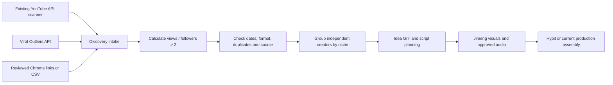

# Outlier discovery tools for this workflow

Reviewed: **2026-09-15**. Scope: first-party product pages, extension listings,
published API contracts, public source code and a free API sample. Paid searches,
extension operation and authenticated connectors have not been tested.

## Recommendation

**Top three: Viral Outliers, Handler, ClipRanker.** This ranking prioritizes
programmable discovery, YouTube/TikTok coverage, raw-data access and low cost for
our existing Python/JSON pipeline. It is an integration-fit recommendation, not
a measured ranking of search quality.

1. **Viral Outliers:** first choice for an API pilot and eventual scheduled
   discovery, subject to freshness/coverage checks.
2. **Handler:** free browser research companion, with a documented read-only
   MCP connector for pulling its TikTok library into an assistant.
3. **ClipRanker:** affordable CSV intake alternative when reviewing known
   profiles in Chrome. Confirm follower-count capture before adopting it.

Keep the existing YouTube Data API scanner. These tools supply additional
research to M1/M2; Jimeng, Vertex/ElevenLabs audio and local Hypit editing remain
the downstream production workflow. Start with the first two free surfaces;
the shortlist does not imply buying three subscriptions.

## Our rule and the current implementation

The requested rule is **a video's views / creator followers or subscribers > 2**.
For example, 40,000 views from a creator with 10,000 followers qualifies at 4×,
even if that creator usually gets 30,000 views per video.

Current code differs:

- `modules/radar/scanner.py` collects YouTube data; it has no TikTok collector.
- `config/system.toml` additionally requires **5× channel median views** and
  an age of at most 14 days.
- `modules/radar/metrics.py:20` combines both conditions with AND, uses `>= 2`,
  and compares ratios rounded to two decimal places.
- Cluster confirmation requires two distinct channels. This is a separate
  niche-validation signal and should not redefine the per-video ratio.
- The scanner's selected video fields do not enforce a Shorts-only discovery
  path. Short-form versus long-form baselines also need explicit treatment.

Recommended design: use the unrounded `views > 2 * followers` comparison for
candidate eligibility; keep performance versus recent median as a separate
ranking signal. Keep freshness, format and cluster confirmation explicit.
Unknown/zero followers mean an unknown ratio, not an automatic win. Record when
both counts were observed; present-day followers are not followers at upload.
YouTube rounds public subscriber counts down to three significant figures, so
borderline results have source precision limits. [YouTube Channel statistics](https://developers.google.com/youtube/v3/docs/channels#statistics.subscriberCount)

No scoring logic, production settings or frozen schemas were changed in this
research task.

## Comparison of all nine candidates

Prices below are the published figures observed during this review, excluding
unverified taxes and regional checkout adjustments. USD unless marked otherwise.

| Tool | Discovery coverage and actual score | Integration and price | Assessment for us |
| --- | --- | --- | --- |
| **Viral Outliers — #1** | YouTube, TikTok, Instagram; score measures performance against the creator's baseline. | REST, CLI, MCP. Free public sample; API-only starter pack **$15 / 1,500 credits**. Web plans **$17 / $37 / $149 monthly**. | Strongest documented automation fit; recompute our ratio from raw counts. [API guide](https://viraloutliers.com/docs), [pricing](https://viraloutliers.com/api/v1/pricing) |
| **Handler — #2** | Extension covers YouTube/Shorts, TikTok and Instagram; views / recent median. Its hosted research/MCP focuses on TikTok. | Free extension; account required for read-only MCP, with plan limits. Homepage displays Starter/Growth/Pro as $29/$49/$119 per month alongside annual totals; do not treat these as verified month-to-month checkout prices. | Useful free browsing and assistant research. Raw follower fields in MCP remain unverified. [Extension](https://gethandler.ai/extension/), [MCP](https://gethandler.ai/mcp/), [plans](https://gethandler.ai/) |
| **ClipRanker — #3** | YouTube/Shorts, TikTok and Instagram; flags 3× median, described as the last 20 posts. | Free: 10 profiles/month. CSV requires Pro: **$12/month or $48/year**. No public API identified in reviewed pages. | Simple file-based bridge; export views, captions and dates, then capture missing follower counts. [Store listing](https://chromewebstore.google.com/detail/clipranker/mgecpndhdeogeoikpjfdgibelpfhlaho), [plans](https://www.clipranker.com/) |
| **Statly** | Instagram, TikTok and X advertised. Video outlier score uses median; its VTFR is **account average views / followers**, not the requested per-video ratio. | Free: 3 scans/day, 30 videos, exports. Pro now **€39/month or €390/year**, with advertised API access. | Strong alternative for watchlists/analytics, but API documentation is less concrete and more Instagram-focused than its platform claims. [Product](https://trystatly.com/), [metrics](https://trystatly.com/glossary), [API](https://trystatly.com/api) |
| **Outliers / free-sort-feed-extension** | Instagram Reels only; default is **at least 5× followers**, plus a minimum-views mode. | Free extension, CSV, public TypeScript source. Manifest grants Instagram hosts only. | Closest denominator, wrong default threshold and platforms for this task. Useful reference implementation; no license file/license declaration was found in the reviewed repository. [Repository](https://github.com/RostyslavDzhohola/free-sort-feed-extension), [listing](https://chromewebstore.google.com/detail/outliers/heogkfpbeagpoodininnfhdgjmpdalgj) |
| **Viral Finder** | Extension: YouTube and TikTok, configurable 2–10× **median** threshold. Web app also analyzes Instagram; its 0–100 AI viral score is another metric. | Free extension with URL copying. Site: Free, Creator **R$297/month**, Agency **R$397/month**, with annual discounts. | Useful free alternative to Handler for browsing; copying URLs does not supply a full metrics dataset. [Extension](https://chromewebstore.google.com/detail/viral-finder-%E2%80%94-outlier-de/igacogmobnjjhldkiknliimjcalmbchk), [app](https://www.viralfinder.ai/en) |
| **1of10** | YouTube; performance against channel average, plus topic/thumbnail research. | Free search/bookmarks and tracking up to 3 channels. Displayed annual plans: Basic **$349/year**, Pro **$828/year** (advertised as about $29/$69 per month). | Useful YouTube specialist, but overlaps our native scanner and does not solve TikTok intake. No public ingestion API identified in the pages reviewed. [Official site](https://1of10.com/) |
| **vidIQ Outliers** | YouTube research with baseline-based scores; views/subscribers and velocity filters are documented. Separate Instagram features now also advertised; TikTok discovery not established. | Outliers page currently says **6 free videos per search**, not 8. Recent first-party pricing comparison lists Boost **$19/month or $199/year**; main plans page did not expose a reliable numeric Boost quote in this fetch. | Useful YouTube validation tool, lower incremental value for our TikTok gap. [Outliers](https://vidiq.com/features/outliers/), [score/filter docs](https://support.vidiq.com/en/articles/9660010-outliers), [first-party pricing](https://vidiq.com/compare/vidiq-vs-socialblade/), [Instagram](https://vidiq.com/instagram/) |
| **ViewMaxxer** | Current feature claims could not be verified. | The supplied domain returned a minimal JavaScript redirect to `/lander`, rather than a product/pricing page. | Exclude from the shortlist until a working product and current terms can be inspected. The supplied free-search allowance and Pro price remain unverified. [Supplied site](https://www.viewmaxxer.com/) |

## Why Viral Outliers is first

The documented search accepts platform, keyword, content type, view/follower
bands and time windows; pages can contain up to 100 results. Its profile endpoint
supplies follower counts. This is the clearest route to a Python adapter among
the reviewed candidates. `minOutlierScore` filters baseline performance; setting
it to 2 does **not** implement our views/follower condition. Start with broad
retrieval and calculate our eligibility locally. Catalog selection itself may
still miss qualifying videos, so retain direct YouTube/profile scans.
[Search contract](https://viraloutliers.com/docs/skills/api/search-viral-outlier-posts),
[profile contract](https://viraloutliers.com/docs/skills/api/get-social-media-profile-stats),
[OpenAPI](https://viraloutliers.com/openapi.json)

Free live checks of `/api/v1/trending` and `/api/v1/pricing` returned HTTP 200.
The observed sample contained 12 posts: 10 TikTok and 2 Instagram, including
3 photo posts. There were only 10 distinct creators, despite the documentation's
one-per-creator claim. No publication timestamps were present, and there were
no YouTube examples in this sample. This proves usable raw-count access, not
coverage, freshness or authenticated search quality.

One returned item had 567,779 views and 31,400 followers: our ratio is **18.08×**,
while the provider's `outlierScore` was **58.84×**. Keep those fields separate.
Evidence: `data/production/outlier-tools-research-20260915/public-api-check.json`.
[Free-feed documentation](https://viraloutliers.com/docs/skills/api/trending-viral-posts)

The live rate card lists 1 credit per search/profile read, 10 per transcription,
and 40 per new-profile crawl; polling is free. At the starter-pack rate those are
$0.01, $0.10 and $0.40 respectively. Subscriptions are optional for the API;
free web trials do not grant the paid-invoice API credit allowance. Add spend
accounting and pagination limits before scheduling it.
[Getting started](https://viraloutliers.com/docs/getting-started),
[credit rules](https://viraloutliers.com/docs/skills/api/api-pricing)

## Why Handler and ClipRanker are the other two

**Handler** fits interactive research in the user's existing Chrome profile.
Its MCP documentation describes read-only library/search access with account
authorization. We should first verify which fields a real tool response returns;
neither automatic follower extraction nor full three-platform MCP coverage has
been established. Its video-generation product is unnecessary for our chosen
Jimeng/audio/Hypit workflow. [MCP scope](https://gethandler.ai/mcp/)

**ClipRanker** fits our existing JSON-on-disk architecture through a small CSV
importer. Its export documentation lists views, captions and dates, but does not
establish a raw follower-count column. Obtain that count separately if absent.
Its extracted caption opening is not necessarily the video's spoken/visual
hook. The browser listing's data disclosures also differ from the broad
on-page privacy wording; inspect the installed permissions before any pilot.
[Export and extension details](https://chromewebstore.google.com/detail/clipranker/mgecpndhdeogeoikpjfdgibelpfhlaho)

Statly is the closest alternative to ClipRanker. However, its API pages use both
`/v1/report` and `/scan` examples without a complete base URL/authentication
contract, and its developer explanation focuses on an Instagram browser session.
Validate TikTok responses, follower fields and unattended access before buying
Pro for automation. CSV is the clearer initial integration path.
[API overview](https://trystatly.com/api), [developer page](https://trystatly.com/for-developers)

## Proposed integration, after selection

1. Create a separate discovery artifact with platform, native post/creator IDs,
   canonical URL, views, followers, publication time, observation time, content
   type, provider and the separately named provider score. Preserve raw evidence.
2. Calculate the strict ratio using available raw counts. For YouTube, enrich
   candidates through the current official API. For other platforms, reject
   missing denominator/date fields from automatic eligibility pending enrichment.
3. Apply the chosen recency window separately. Exclude photos/slideshows when
   asking for video-only results; compare Shorts with Shorts when ranking by
   typical performance. Do not label absent dates as fresh.
4. Deduplicate by platform/post ID and limit each creator's influence. Require
   independent creators to confirm a niche; repeated posts are not confirmation.
5. Pass reviewed candidates to M2 and use source links for format/hook research.
   Resolve the cross-platform M1/M2 mapping explicitly before implementation;
   do not silently reinterpret the frozen YouTube-era contract fields.
6. Persist search pages and quota/credit use. Cache profile counts for the same
   observation window. Schedule only after a representative pilot passes.

### Pilot acceptance criteria

- Test the same two niches on YouTube and TikTok, including known qualifying
  posts that do not beat their creator's median by 3× or 5×.
- Check 20 returned videos against visible source counts and dates. Record
  rounding/staleness, missing followers, unavailable posts and false matches.
- Confirm that exactly 2× fails and greater than 2× passes before display rounding.
- Measure qualifying results per research dollar and human review minute.
- Require replayable JSON/CSV, complete provenance and no duplicate creator votes.

Public documentation can establish intended capabilities; this pilot establishes
whether the chosen service supplies useful, current data for our niches.

## Attached skill

The supplied Motion Craft skill specifies native Higgsedit animation timing and
property tracks. It has no discovery/data-collection capability and is relevant
only to a later motion-graphics task. No rendering or extension installation was
performed as part of this review.
