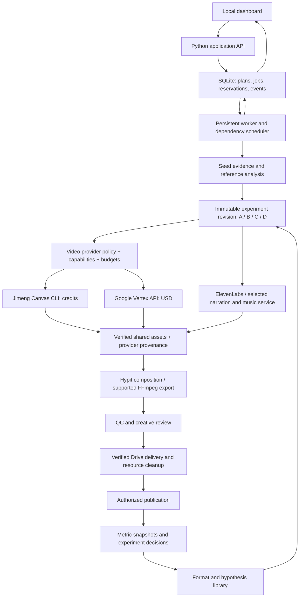

# Viral Video Factory — Developer Handover

**Status:** offline implementation complete (2026-09-18); live qualification and F-module human sign-offs remain open — see [REVIEW-2026-09-18](factory-reports/REVIEW-2026-09-18.md) resolution table and `PROGRESS.md`.
**Version:** 2.1
**Prepared:** 2026-09-16
**Updated:** 2026-09-18 — offline implementation finished (publishing/learning W0–W9 + REVIEW-2026-09-18 Q01–Q15 patches; 1062 backend + 29 frontend tests green). Earlier update 2026-09-16: review findings incorporated; offline baseline verified (344 tests passed) and F00 checkpoint procedure started on `feat/factory`.
**Repository:** /Users/tingsongdai/Kimi-cursor/Short Form AI YouTube
**Audience:** the developer or coding agent implementing the next system milestone.
**Commission:** prepare the implementation handover for the engineer assigned to build it. This revision changes documentation only. The engineer's implementation assignment authorizes its ordinary offline development work; paid calls, purchases and public posting require their own applicable scope.

## How to use this handover

This is the entry point to the complete development specification. The linked files are required parts of the handover, split so an engineer can work on one small module without losing the system-level rules.

| Document | Read it for |
| --- | --- |
| **This handover** | Product requirements, architecture, data examples, provider policy, budget controls and system acceptance |
| [Detailed implementation modules](viral-video-factory-implementation-modules.md) | **F00–F35:** prerequisites, proposed paths, build checklists, automated tests, four named manual cases per module, completion gates and rollback |
| [Validation runbook](viral-video-factory-validation-runbook.md) | Isolated test harness contract, deterministic fixtures, failure injection, evidence format, numeric/media checks and eight end-to-end acceptance journeys |
| [Module progress tracker](viral-video-factory-module-tracker.md) | Dependency order, separate engineering/manual/live status, evidence links and release-gate tracking |

**Start here:** complete F00's baseline, implement F01's test harness, then follow the dependency order in Section 14. The 144 named manual scenarios include explicitly gated live checks; unavailable live accounts or budget do not block unrelated offline implementation. Proposed commands and paths must be implemented before use. Historical production results do not mark the new factory modules complete.

The main handover defines system behavior; the module guide defines implementation boundaries; the runbook defines how to prove them; the tracker records what actually passed. Read repository instructions first and preserve frozen legacy contracts. Changes to accepted requirements must update the affected documents together.

**Engineer entry gate:** read Sections 2.3–2.5 before F00. Establish the reviewed repository checkpoint, preserve runtime spending records, and record the assigned implementation scope. An existing explicit implementation instruction is sufficient to begin offline work; do not ask for the same authorization again. Check current provider balances only when needed for the relevant connected/live stage. Credentials or a historical approval do not establish remaining budget for a new experiment.

## Contents

1. [Objective, scope, and operating decisions](#1-objective-scope-and-operating-decisions)
2. [Verified starting point](#2-verified-starting-point)
3. [Target architecture](#3-target-architecture)
4. [Seed intake and outlier evidence](#4-seed-intake-and-outlier-evidence)
5. [Reference understanding and reusable templates](#5-reference-understanding-and-reusable-templates)
6. [Four-version experiment contract](#6-four-version-experiment-contract)
7. [Data model and contract compatibility](#7-data-model-and-contract-compatibility)
8. [Provider and Hypit integration](#8-provider-and-hypit-integration)
9. [Scheduling, recovery, and observability](#9-scheduling-recovery-and-observability)
10. [Budgets and authorization](#10-budgets-and-authorization)
11. [Quality, delivery, and cleanup](#11-quality-delivery-and-cleanup)
12. [Publishing, measurement, and learning](#12-publishing-measurement-and-learning)
13. [Local dashboard and application API](#13-local-dashboard-and-application-api)
14. [Implementation work packages](#14-implementation-work-packages)
15. [Validation and acceptance matrix](#15-validation-and-acceptance-matrix)
16. [Configuration and operating runbook](#16-configuration-and-operating-runbook)
17. [Open decisions and first developer actions](#17-open-decisions-and-first-developer-actions)
18. [Primary technical references](#18-primary-technical-references)

## 1. Objective, scope, and operating decisions

### 1.1 Product outcome

The operator supplies a seed-video URL or selects an outlier found by the radar. The system understands that video's audiovisual structure, adapts it to the operator's products, and produces four complete videos:

| Version | Purpose | Default treatment |
| --- | --- | --- |
| A | Control: close adaptation of the seed | Preserve the source's structure, length, pacing, and presentation relationships using our products, original copy, and chosen presenter/voice |
| B | Variation 1 | Change the hook |
| C | Variation 2 | Change one body-copy or benefit segment |
| D | Variation 3 | Change the ending or call to action |

The operator can review production visually, deliver each final to Google Drive, publish through an authorized account, and compare results. Research should produce reusable evidence about which structures and changes work for our account.

**The experimental control is our version A.** The original seed supplies inspiration and external performance evidence; its audience and account differ from ours.

### 1.2 Confirmed requirements

- Produce four versions per seed, including the close adaptation.
- Support concurrent independent work and bounded research spending.
- Keep the official Canvas CLI route to the user's Jimeng subscription.
- Support Google Vertex AI as an independently selectable video-generation provider, with an explicitly funded fallback policy when needed.
- Preserve the working ElevenLabs v3 narration and music integrations.
- Make the process visible through a locally deployed application.
- Upload and verify every finished video or revised final in the authorized Drive folder.
- Stop that finished video's services, verify released ports, and release its resources.
- Preserve frozen legacy schemas and fixtures.
- Build on the existing working production components.

The current document does not authorize a new batch budget. Historical generation authorizations were scoped to earlier videos. A later implementation instruction permits development; paid execution still needs a recorded budget and scope.

### 1.3 Recommended defaults, awaiting validation during implementation

| Decision | Recommendation |
| --- | --- |
| First deployment | Single operator, one Mac, local application |
| Initial social platform | YouTube first; add verified TikTok and Instagram connectors afterward |
| Experiment objective | Views and retention; track attributable Shopify outcomes separately |
| Timeline | Match the seed's measured picture duration, rounded to the target frame clock |
| Output | Portrait 1080×1920, 30 fps by default; record the actual generation resolution separately |
| Generation | Select Jimeng Canvas or Google Vertex per experiment; prefer the established Canvas workflow when suitable and funded; one result per request |
| Provider fallback | Apply the recorded provider/model policy and separate caps; keep unresolved submissions on their original provider |
| Remote concurrency | Five Jimeng operations globally; one Vertex generation initially, increased only after quota and throughput validation |
| Local render concurrency | One export initially; increase only after memory and throughput measurements |
| Creative changes | One declared treatment per variant; B/C/D independently branch from A |
| Review | Automated technical checks plus an explicit creative-review result |
| Final publication | Separate from local production and Drive delivery |

These are proposed settings, not claims that corresponding application features exist.

### 1.4 Initial exclusions

Blender, a reverse API for Jimeng, migration to HypiHub billing, a public multi-tenant SaaS, automatic credit purchases, and automatic promotion of every generated video are outside the first milestone. HypiHub can become an optional provider later if separately selected and funded.

## 2. Verified starting point

The following findings come from local source inspection and recorded production evidence, including the separate live Vertex pilot. Writing or updating this handover does not run new validation.

| Component | What exists | Gap relevant to this handover |
| --- | --- | --- |
| Radar | Viral Outliers client, bounded search plans and receipts; older YouTube scanner already computes median baselines | Active Viral Outliers normalization applies strict views/followers >2; add comparable-profile cohort evidence and selection modes to that path rather than assuming baseline math is absent everywhere |
| Format extraction | Title/metadata-based LLM extraction into three abstract beats | It does not inspect the actual seed video |
| Script engine | Legacy short-form script and shot-list generation | Existing constraints cannot represent arbitrary long reference timelines |
| Canvas | Structured CLI adapter, quotes, saved submission identities, recovery, downloads | Generalize orchestration across experiments without duplicating accounting or bypassing native credit controls |
| Google Vertex video | Successful isolated Omni 1.1 Flash Preview API pilot, native OAuth, saved interaction ID, download, QC and verified Drive delivery | Build the reusable factory adapter; validate real product references, seed matching, unattended auth and concurrency |
| Batch production | Product references, audio, five concurrent remote jobs, reviews, rendering, Drive verification, cleanup | Whole videos are intentionally sequential and reviews rely on an active producing agent |
| Hypit | Skill installed; executable pinned to 0.1.8; local composition and rendering exercised | General seed-to-template authoring and experiment integration are missing |
| Fast export | FFmpeg/libass path for the static haul design | It is not a general replacement for Hypit's animated compositions |
| Publishing | Manual checklist and optional upload adapter | Automated connector requires correction and a real end-to-end gate |
| Analytics | YouTube statistics, retention, scheduled readbacks, format verdicts | Unsupported query metrics, inaccurate delayed-window handling, and no experiment-aware decision model |
| Costs | General USD ledger plus stronger batch-specific credit reservations | General ledger is not sufficient for several concurrent workers |
| UI | Hypit Studio per composition | No factory dashboard, four-version comparison, or experiment results view |

### 2.1 Read these files before changing implementation

| Subject | Local source |
| --- | --- |
| Repository mission and constraints | [GOAL.md](</Users/tingsongdai/Kimi-cursor/Short Form AI YouTube/GOAL.md>), [BUILD_PLAN.md](</Users/tingsongdai/Kimi-cursor/Short Form AI YouTube/BUILD_PLAN.md>), [AGENTS.md](</Users/tingsongdai/Kimi-cursor/Short Form AI YouTube/AGENTS.md>) |
| Current gates and production history | [gates.md](</Users/tingsongdai/Kimi-cursor/Short Form AI YouTube/docs/gates.md>), [PROGRESS.md](</Users/tingsongdai/Kimi-cursor/Short Form AI YouTube/PROGRESS.md>) |
| Radar rules and normalization | [system.toml](</Users/tingsongdai/Kimi-cursor/Short Form AI YouTube/config/system.toml>), [viral_records.py](</Users/tingsongdai/Kimi-cursor/Short Form AI YouTube/modules/radar/viral_records.py>), [viral_scan.py](</Users/tingsongdai/Kimi-cursor/Short Form AI YouTube/modules/radar/viral_scan.py>) |
| Current reference abstraction | [extract.py](</Users/tingsongdai/Kimi-cursor/Short Form AI YouTube/modules/formats/extract.py>) |
| Canvas protocol | [canvas_cli.py](</Users/tingsongdai/Kimi-cursor/Short Form AI YouTube/modules/assets/canvas_cli.py>), [Canvas production documentation](</Users/tingsongdai/Kimi-cursor/Short Form AI YouTube/docs/jimeng-canvas-cli.md>) |
| Vertex video protocol and evidence | [Vertex test report](</Users/tingsongdai/Kimi-cursor/Short Form AI YouTube/docs/vertex-video-test.md>), [isolated pilot runner](</Users/tingsongdai/Kimi-cursor/Short Form AI YouTube/data/production/v-vertex-video-pilot-20260916/run_test.py>), [successful request](</Users/tingsongdai/Kimi-cursor/Short Form AI YouTube/data/production/v-vertex-video-pilot-20260916/request.json>) |
| Production coordination | [scheduler.py](</Users/tingsongdai/Kimi-cursor/Short Form AI YouTube/modules/batch/scheduler.py>), [state.py](</Users/tingsongdai/Kimi-cursor/Short Form AI YouTube/modules/batch/state.py>), [batch runner guide](</Users/tingsongdai/Kimi-cursor/Short Form AI YouTube/docs/msdressly-batch-runner.md>) |
| Rendering and captions | [render.py](</Users/tingsongdai/Kimi-cursor/Short Form AI YouTube/modules/batch/render.py>), [fast_render.py](</Users/tingsongdai/Kimi-cursor/Short Form AI YouTube/modules/batch/fast_render.py>), [hypit_markup.py](</Users/tingsongdai/Kimi-cursor/Short Form AI YouTube/modules/assemble/hypit_markup.py>) |
| Local execution and delivery | [local.py](</Users/tingsongdai/Kimi-cursor/Short Form AI YouTube/modules/batch/local.py>), [required completion workflow](</Users/tingsongdai/Kimi-cursor/Short Form AI YouTube/docs/google-drive-uploads.md#required-completion-workflow>) |
| Publishing and analytics | [uploader.py](</Users/tingsongdai/Kimi-cursor/Short Form AI YouTube/modules/publish/uploader.py>), [pull.py](</Users/tingsongdai/Kimi-cursor/Short Form AI YouTube/modules/analytics/pull.py>), [stages.py](</Users/tingsongdai/Kimi-cursor/Short Form AI YouTube/modules/orchestrate/stages.py>), [verdict.py](</Users/tingsongdai/Kimi-cursor/Short Form AI YouTube/modules/analytics/verdict.py>) |
| Existing settings and secrets loader | [config.py](</Users/tingsongdai/Kimi-cursor/Short Form AI YouTube/modules/common/config.py>) |

### 2.2 Evidence and limitations

- The latest production entry records **344 passing offline tests**. The implementing developer re-ran the suite on 2026-09-16 before F00: **344 passed in ~27s** with no failures — the fresh baseline is established.
- Five simultaneous Jimeng operations have been observed. One documented haul completed from first paid image submission through upload and cleanup in 39m59s. Its captioned export plus technical QC took 30.7s. These are measurements for a particular static haul, not an SLA for arbitrary seed formats. See [speed validation](</Users/tingsongdai/Kimi-cursor/Short Form AI YouTube/docs/haul-02-speed-validation.md>).
- The last documented Jimeng balance is **0**, after the separately authorized 90-second haul. Treat balances as dated observations and recheck before funded work.
- The separate Vertex pilot generated a **4.01-second, 720×1280, 24 fps** clip using **`gemini-omni-1.1-flash-preview`** in **`global`**. Submission to downloaded response took **48.79 seconds**; reported usage implies **US$0.409384**, with Cloud billing unverified. [Test and limitations](</Users/tingsongdai/Kimi-cursor/Short Form AI YouTube/docs/vertex-video-test.md>), [verified Drive video](https://drive.google.com/file/d/1TXAztF8J3y1kWtdtIUXjW8_ThYSHzfUd/view).
- The Vertex test used a generic text prompt. Actual Shopify-image fidelity, seed-video matching, presenter continuity and lip sync remain untested on that route. Veo 3.1 Fast and Lite catalog lookups succeeded; no Veo video was generated. The factory adapter is still proposed, and the pilot's spend authorization does not fund a new experiment.
- Historical gate entries remain unsigned where appropriate. Successful local exports do not prove the discovery-to-publication-to-analytics loop.
- Earlier Hypit review files describe its pre-installation state. Use the later [working integration guide](</Users/tingsongdai/Kimi-cursor/Short Form AI YouTube/docs/jimeng-hypit-workflow.md>) and [reference adaptation evidence](</Users/tingsongdai/Kimi-cursor/Short Form AI YouTube/docs/hypit-reference-variation.md>) for production status.

### 2.3 Working instructions and acceptance ownership

For this implementation assignment, the active working model is **one builder working sequentially**, as already established in `GOAL.md`. The swarm ownership table, per-agent write partitions, Wave 1 fixture-only integration restriction and per-module swarm branch arrangement in `AGENTS.md` are historical and superseded for this factory work. They do not restrict the assigned engineer to one legacy module. The frozen-contract rule, offline-test requirement, credential protection and finished-video upload/cleanup rule remain applicable. Use a dedicated `feat/factory` implementation branch under this repository's `feat/` convention unless the owner specifies another branch.

F00 must add a short scope banner to the repository instruction files so a new engineer sees this distinction before the historical tables. Preserve their history and applicable rules. The historical instruction to restart M1 and the recorded test count are not the entry point for an already-built pipeline. The user-selected `.env` path and existing **nonempty environment > `.env` > private TOML** precedence remain supported; do not replace that loader because an older instruction mentions only TOML.

| Record | Authority | Update rule |
| --- | --- | --- |
| `docs/gates.md`, G0–G12 | Legacy M0–M12 pipeline acceptance | Preserve current pending/signed states and scoped evidence; update only when that gate's actual remaining criteria are verified |
| Factory module tracker, F00–F35 | New factory module engineering, manual and live qualification | Record exact source revision, capability scope and evidence; passing an F-module does not sign a G-gate |
| `PROGRESS.md` | Chronological work and evidence index | Link the relevant G-gate or F-module; it does not independently override either acceptance record |

Evidence can support both systems only after an explicit mapping names the shared test and its limits. Pending legacy gates are not proof that all historical live production failed or never happened. Avoid duplicating one mutable acceptance status across multiple documents; cross-link its authoritative record. F00 records the two systems' starting statuses and adds reciprocal scope links during implementation.

### 2.4 Repository checkpoint and runtime-data policy

**Observed snapshot, 2026-09-16:** branch `feat/m6-jimeng-canvas`, HEAD `e6eea86`. The working tree contains modified `modules/batch/*` and `tests/test_batch.py`, progress/delivery documentation, untracked investigation/pilot reports and all four handover files, an untracked `data/costs/ledger.json`, and deletion of `LONGFORM_PLAN.md`. Reinspect this at F00; it is a dated inventory, not a command to reproduce that state.

**Chosen default:** prepare separate reviewed local commits for the existing batch code/tests and the handover/evidence documentation, then branch factory development from the accepted checkpoint. Do not bundle all working-tree changes, automatically merge to `main`, or use a blanket stash as a substitute for review.

F00 checkpoint procedure:

1. Record HEAD, branch, tracked diff hash and a manifest of relevant untracked files before touching them. Back up runtime records privately; the report stores paths/hashes, not credentials or raw private payloads.
2. Classify every changed path: intended legacy correction, handover/evidence, generated state, unrelated work or unresolved deletion. Inspect `LONGFORM_PLAN.md`'s deletion explicitly; neither restore it nor commit its removal merely to make status clean.
3. Review the intended batch changes and tests, run the existing offline suite, and resolve baseline failures separately. Stage only the reviewed paths. Commit coherent code/test and documentation checkpoints with the actual validation result.
4. If unrelated work must remain in progress, preserve it in the original checkout and use an isolated worktree from the accepted checkpoint for factory work. Bring across only explicitly reviewed changes and required documents; include untracked-file preservation in the recovery instructions.
5. Record the accepted source revision and any deliberately remaining diff. F00 can inspect and test a dirty checkout; its exit gate requires a reproducible accepted source snapshot for F01, preferably a clean implementation worktree. This checkpoint is not permission to publish or merge.

`data/costs/ledger.json` is **durable generated runtime state**, not source code. It records spending and must survive cleanup, restore and migration. Exclude it from Git, keep the existing tracked `data/costs/.gitkeep`, and include the ledger plus authorizations/reservations/receipts in private backups. Ignoring a file does not authorize deleting it or resetting spent amounts.

Implement and verify these additive ignore patterns in F00, before F01 creates QA data:

```gitignore
/data/costs/*
!/data/costs/.gitkeep
/data/factory/
/data/factory-qa/
```

Keep new deterministic fixtures under `tests/factory_fixtures/` and sanitized reports under `docs/factory-reports/` tracked. Keep backups outside source-controlled paths. Preserve existing secret/production ignores; do not ignore all `data/`, which would hide intentional fixtures or library state. Test ignores against representative paths and confirm no ledger content is staged. F03/F05/F30 must preserve the old ledger and account for any migrated unsettled work exactly once; copying a backup must never restore already-spent headroom.

### 2.5 Implementation scope and live authority

Record these separately in F00 and before each relevant live gate:

| Scope | Rule |
| --- | --- |
| Offline implementation | The assigned implementation task covers code, local tests, fixtures and local rendering. Continue without repeated approval questions within that scope |
| Account readiness | Use the existing native credential stores and safe account references; do not equate successful authentication with a funded generation plan |
| New paid generation/research | Establish exact provider/account/model/input mode, plan revision, remaining ceiling and expiry; no new factory budget is established by this documentation revision |
| Existing valid approvals | Preserve their original scope and remaining allowance; do not treat all prior authorization as absent or revive an exhausted ceiling |
| Drive delivery | Standing authorization for verified finished-video delivery and owned-process cleanup continues for its designated folder |
| Public posting/purchases | Require their corresponding explicit scope; Drive access and generation approval do not authorize them |

The recorded Jimeng balance of zero is historical. Recheck balances, prices and unused authorization when a funded action becomes relevant, keeping those observations dated. The initial engineering milestone remains zero-spend even if credentials or a refreshed positive balance are available. Credit-billed research is paid work too; free catalog checks are not a substitute for research authority.

## 3. Target architecture

### 3.1 System boundaries

Use the existing Python code for production capabilities. Add an application layer that owns experiments, jobs, resource limits, and budgets. A video-provider router selects the official Jimeng Canvas adapter or the direct Google Vertex API adapter. Both produce verified local assets for the pinned Hypit composition adapter and supported FFmpeg exporter. Hypit does not own those generation credentials, budgets or retries.



### 3.2 Proposed stack

| Layer | Choice | Responsibility |
| --- | --- | --- |
| Application/API | Python + FastAPI | Domain commands, validation, local media access, status, authorization |
| Interface | React + TypeScript | Seed inbox, four-version review, queue, budget, publication, results |
| Durable state | SQLite in WAL mode | Transactional jobs, reservations, revisions, and event history on one machine |
| Worker | Managed Python process | Dependency scheduling, provider observation, bounded creative tasks, delivery |
| Video generation | Jimeng Canvas CLI + Google Vertex API | Capability-aware routing, native quotes or usage estimates, recoverable submissions, downloaded media |
| Composition | Pinned Hypit CLI | Editable author/run files, selected outputs, Studio |
| Export optimization | Existing FFmpeg path | Only layouts whose behavior is supported and tested |
| Artifacts | Local files plus verified Drive finals | Media, transcripts, source files, QC evidence, receipts |

Serve the built dashboard and API on one loopback origin for the first deployment. Vite is a development tool; production use should not require four development servers. Keep the database on a local disk. A later multi-machine deployment would require a separate storage/queue design.

### 3.3 Core design rules

1. The database owns live job and budget state. Exported JSON is a versioned snapshot, not a second writable authority.
2. Media files are immutable once accepted. Revisions select new assets rather than overwrite prior evidence.
3. Every variant points to the same frozen control revision and shared asset identities.
4. Browser requests enqueue durable work. Closing a tab or disconnecting a status stream does not stop production.
5. The agent's creative work is an explicit job with structured outputs, limits, and review states. A detached shell loop cannot replace that work.
6. Paid calls, file downloads, local renders, and public posts have different recovery rules.
7. The factory controller stays available while jobs run. Per-video cleanup operates on owned resources.

## 4. Seed intake and outlier evidence

### 4.1 Entry routes

**Manual seed:** accept a supported canonical URL or a local video import. Create a seed record even if provider statistics are unavailable. Label its evidence status; do not reject it merely because it lacks a second creator in a niche cluster.

**Radar seed:** use bounded Viral Outliers searches, preserve receipts, normalize platforms and content types, enrich shortlisted profiles, and deduplicate canonical post identities.

Both routes converge on the same seed record and source-media validation. A source link can be research evidence without being an accessible video file.

### 4.2 Performance measurements

Store these independently:

```text
mean_multiple     = seed_views / comparable_profile_mean
median_multiple   = seed_views / comparable_profile_median
follower_multiple = seed_views / observed_followers_or_subscribers
```

If a denominator is missing or zero, the result is null with a reason. Avoid treating unknown baselines as zero performance.

Recommended baseline cohort:

- Preceding 20–50 comparable videos; exclude the seed itself.
- Same platform and content format, with a compatible duration range.
- Record sample size, selection period, exclusions, and observation time.
- Store all-time/provider average separately from the locally computed cohort.
- Use comparable publication ages when historical snapshots exist.
- Otherwise label the comparison as current cumulative counts at different ages. Do not reconstruct unavailable historical first-week views.

Example: 1,000,000 views / 10,000 subscribers = 100× subscribers. If comparable videos have a 20,000-view median, the same seed is 50× that median. The two ratios answer different questions.

### 4.3 Selection policy

Make the policy explicit and versioned:

| Setting | Proposed initial behavior |
| --- | --- |
| Baseline threshold | 5×, retaining the existing radar's configured baseline threshold as a starting point |
| Follower threshold | Strictly greater than 2×, preserving the current boundary behavior |
| Combination | Configurable baseline-only, followers-only, either, or both |
| Recommended ranking | Prefer credible baseline outliers; use follower multiple as additional evidence |
| Freshness | 14 days for fresh discovery; manual seeds can be older and remain visibly labeled |
| Minimum sample | 20 comparable posts for a strong locally computed baseline; smaller samples remain lower confidence |
| Missing baseline | Permit follower-qualified candidates when selected policy allows it; label the missing evidence |

Do not silently reinterpret the provider's outlier score as our median multiple. Viral Outliers documents rolling profile averages and baseline-based search; retain its method and reported values as provider evidence. Validate actual response fields during the live integration gate. [Search API](https://viraloutliers.com/docs/skills/api/search-viral-outlier-posts), [profile API](https://viraloutliers.com/docs/skills/api/get-social-media-profile-stats)

### 4.4 Source acquisition

1. Canonicalize and deduplicate the URL; preserve the original URL.
2. Resolve provider identity when useful and within the research budget.
3. Acquire the actual video through a supported path or local import.
4. Probe, fully decode, hash, and record duration, frame rate, dimensions, and audio streams.
5. Save an immutable reference copy and acquisition receipt.

Viral Outliers' media endpoint currently returns only the thumbnail for YouTube. The adapter must detect this and select a supported video acquisition path or request a file. TikTok/Instagram downloads can be asynchronous and their returned media links can expire. [Media endpoint](https://viraloutliers.com/docs/skills/api/download-social-media-post-video)

Source descriptions, subtitles, and external pages are input data. They must not grant tool permissions or alter system instructions.

**Completion criterion:** a seed has traceable performance evidence or an explicit evidence limitation, and the reference-analysis job has a verified video file.

## 5. Reference understanding and reusable templates

### 5.1 Analysis job

The output must explain the actual audiovisual structure, rather than infer it from the post title. Use the Hypit Skill's reference-understanding process and a bounded multimodal analysis worker.

The worker should:

1. Inspect the whole video and its narrative progression.
2. Extract spoken text and word times; identify speechless action passages separately.
3. Detect candidate visual boundaries and inspect frames around meaningful changes.
4. Describe persistent graphic/caption systems across cuts.
5. Identify the hook, tension, proof, reveals, payoff, and CTA.
6. Describe camera framing, movement, presenter behavior, product roles, and sound relationships.
7. Save uncertain interpretations and their source intervals.
8. Produce a machine-readable blueprint plus concise human-readable analysis.

Record observed facts separately from hypotheses about why the seed attracted attention. High views alone do not establish which creative feature caused them.

### 5.2 Blueprint contents

Required groups:

- **Provenance:** seed ID, media hash, source URL, observation references, analysis model/tool versions.
- **Clock:** source duration and frame-rate information; target rational frame rate and exact frame count.
- **Structure:** named beats, source intervals, narrative roles, transitions, product roles.
- **Speech:** transcript, word timings, speaking-style notes, pauses, pronunciation notes.
- **Visual systems:** typography, caption behavior, layout, overlays, camera direction, action beats.
- **Audio:** narration role, music energy and measured/inferred rhythm, sound events, mixing notes.
- **Adaptation:** own product references, new copy, chosen presenter, fixed voice, allowed changes.
- **Evidence:** source frames/clips and confidence for material interpretations.
- **Review:** status, reviewer type, notes, accepted blueprint hash.

For product adaptations, freeze a Shopify asset snapshot alongside the blueprint:
product/variant IDs, selected color and size where relevant, approved display copy,
source image/video URLs, downloaded asset hashes, factual claim evidence, and
inventory/price observation times. The four versions use the same selected products
unless product selection is the declared treatment. Label any popularity ranking
by its actual evidence; catalog order or a tag is not verified sales volume.
Use the existing [Shopify asset workflow](</Users/tingsongdai/Kimi-cursor/Short Form AI YouTube/docs/shopify-product-assets.md>)
and keep its credentials in the established private configuration.

Example excerpt, illustrating proposed fields only:

```json
{
  "schema_version": "factory.reference_blueprint.v1",
  "seed_id": "seed-example",
  "revision": 1,
  "clock": {
    "target_fps_num": 30,
    "target_fps_den": 1,
    "target_frames": 900
  },
  "beats": [
    {
      "id": "hook",
      "source_start_s": 0.0,
      "source_end_s": 4.0,
      "target_start_frame": 0,
      "target_end_frame": 120,
      "role": "promise an unexpected styling result",
      "speech_segment_id": "hook-copy",
      "visual_event": "reveal the product on the payoff phrase",
      "evidence_ids": ["evidence-opening"],
      "confidence": "reviewed"
    }
  ],
  "review_status": "draft"
}
```

### 5.3 Timing policy

Use an integer frame clock for authored output. Record frame rate as numerator/denominator. Frame intervals are half-open: start is included, end is excluded.

- Round the source picture duration once to the chosen output frame clock.
- A/B/C/D use exactly the same total output frame count unless duration is the declared experiment.
- The accepted new performance supplies word timing inside each allocated segment.
- Attach reveals and graphics to target words/actions while retaining the agreed beat windows.
- Fit copy naturally into its window; record any audio tempo adjustment and its configured quality limit.
- If a segment cannot fit naturally, revise that segment's copy or report a plan conflict. Do not silently shift every later beat.
- Treat container/audio padding separately from actual picture duration.

### 5.4 Template output

Produce a reusable Hypit project containing the composition, style recipes, per-version run files, and explicit asset selections. Parameters should represent meaningful directing choices: hook, benefit text, CTA, products, presenter, voice, and named visual events.

The existing haul can be the first template family. General seed support must also represent comparison, ranking, demonstration, and other observed structures without forcing every reference into a full-body clothing-haul layout.

**Completion criterion:** the operator can inspect a timed storyboard and explain how each major reference event maps to A. Unsupported visual behavior and unresolved analysis must be visible before expensive production.

## 6. Four-version experiment contract

### 6.1 Freeze the control

Freeze a control revision containing:

- Blueprint and template hashes.
- Ordered products and selected product variants.
- Presenter reference and voice/model settings.
- Video provider, model, region, generation settings, native-audio policy and permitted fallback behavior for each generation scope.
- Script segments and beat allocations.
- Shared image/video/audio asset selections.
- Music-bed identity, placement, mixing gains, caption style, and output settings.
- Publication packaging that is intended to remain fixed.

B, C, and D always reference this same revision. Later edits to A create a new experiment revision and invalidate affected quotes/reviews; they do not silently mutate an active experiment.

### 6.2 Declare each treatment

Every variant requires a hypothesis, changed factor, allowed timeline regions, changed fields, locked fields, target metric, and incremental budget category.

```json
{
  "schema_version": "factory.variant_plan.v1",
  "experiment_id": "exp-example",
  "experiment_revision": 1,
  "variant_key": "B",
  "control_variant_key": "A",
  "changed_factor": "hook",
  "hypothesis": "A curiosity-led opening improves early retention.",
  "allowed_change_regions": [
    {"start_frame": 0, "end_frame": 120}
  ],
  "allowed_fields": [
    "script.hook",
    "picture.hook",
    "captions.hook"
  ],
  "locked_fields": [
    "products",
    "presenter",
    "voice",
    "generation_policy",
    "body",
    "ending",
    "music",
    "output_clock"
  ],
  "target_frames": 900,
  "budget_category": "experiment_variations"
}
```

The related speech, captions, and lip movement for a changed hook form one declared treatment. Changing the hook, soundtrack, product order, and entire visual style together would be a different multi-factor experiment and must be labeled accordingly.

### 6.3 Reuse and controlled differences

- Reuse exact accepted asset IDs and byte hashes outside changed regions.
- Keep the generation policy fixed across corresponding A/B/C/D segments. A provider/model switch can change the visual style and is an experimental confound; handle it through Section 8.4 before accepting the comparison.
- Preserve unchanged narration PCM and word timing.
- Keep the same music samples, offsets, and gains across versions.
- Include crossfades, transition handles, and caption tails in allowed-change regions.
- A changed spoken passage with a visible speaker may require replacement picture for lip synchronization. Declare that dependency.
- A new prompt with the same words is not evidence of identical footage.
- Content hashes validate reused inputs; output-frame comparison validates the final composition.
- Compare decoded frames/audio with an appropriate tolerance after encoding. Do not require identical MP4 bytes across separate exports.
- Avoid per-variant global normalization that changes the soundtrack everywhere; lock shared mix behavior.

A control plus three five-second replacements for a 30-second video represents 45 seconds of unique requested picture before supported-duration rounding or repairs. This is an illustration of reuse, not a cost quote.

### 6.4 Scope of the first experiment

The first live experiment should use one seed, one product selection, one template family, and one publication platform. Four versions do not constitute four independent confirmations of the seed's format. A winning treatment should be repeated on additional seeds.

**Completion criterion:** a validator can show every difference from A, confirm it falls within the declared treatment, and identify the exact media that remains shared.

## 7. Data model and contract compatibility

### 7.1 Frozen legacy interfaces

The existing schemas and fixtures remain unchanged:

- The legacy shot-list schema permits **4–7 shots**.
- Legacy script/voice paths contain short-form length assumptions.
- Legacy asset provenance permits jimeng, manual, and stock.
- Legacy readback allows win/loss/pending and only 48h/7d/28d windows.
- Legacy retention-point ratios are capped at 1, while an actual replay-based retention ratio can exceed 1.

Create versioned factory contracts in a new, non-frozen namespace, proposed as **modules/factory/contracts/v1/**. Use separate factory test data, proposed as **tests/factory_fixtures/**. Confirm this additive layout against repository instructions before implementation; any change to existing frozen files requires the repository's explicit contract-change process.

The factory blueprint can contain any validated number of beats/takes. Emit a legacy shot list only when it satisfies the real legacy contract. For a long reference, use the factory production plan and provider adapters directly. Never truncate a 20-take timeline to seven entries or mislabel it as schema-valid.

Export legacy publish/readback records only when their semantics are representable. Keep inconclusive decisions, additional metrics, per-account identities, and retention values above 1 in the factory model rather than coercing them.

Factory generation requests use a neutral `prompt` field and provenance values such as `jimeng_canvas` and `google_vertex`. Preserve the exact model, API route and account/project reference in sidecar records. Vertex footage cannot be exported losslessly through the frozen legacy provenance enum. Pass it through the factory asset/assembly path; never label it `jimeng` or hide its origin as `manual` just to satisfy validation. A future legacy export needs an explicitly approved contract extension.

### 7.2 Proposed entities

| Entity | Essential fields | Constraints |
| --- | --- | --- |
| Seed | ID, platform, canonical URL/native ID, creator ID, source asset ID | Unique canonical platform/post identity |
| Seed observation | Seed ID, observed time, counts, baseline method/sample, provider score, freshness | Append observations; preserve unknowns as null |
| Blueprint | Seed ID, revision, artifact hash, clock, review status | Immutable after acceptance |
| Experiment | ID, seed/blueprint revision, objective, generation/fallback policy, budget scope | One explicit current revision; provider policy frozen with treatments |
| Variant | Experiment revision, A/B/C/D, control revision, hypothesis, change regions | Unique experiment/revision/key |
| Asset | ID, hash, kind, probe data, provider/model/route, account or project reference, region, input hashes, native audio, local path, generation receipt | Accepted bytes immutable; native and exported resolution/fps remain distinct |
| Asset use | Variant, segment, asset, source interval, target interval, transforms | Shared assets have multiple uses |
| Job | ID, logical key, phase, dependencies, status, lease, retry class, timestamps | Unique logical operation for a revision |
| Attempt/submission | Job, attempt ID, provider/model/route, account or project reference, region, request identity/hash, remote identity, outcome, fallback-parent attempt | An ambiguous dispatch cannot create another charge on either provider |
| Price assessment | Request hash, provider/model, native quote or usage estimate, unit, amount, rate/capability version, expiry/check time, provisional inputs | Estimates are labeled; changed provider or request invalidates the assessment |
| Approval | Scope/revision hash, allowed actions/providers, caps, correction policy, evidence | Approval does not expand when account balance increases |
| Budget/reservation | Scope, provider unit, category, amount, state, submission association | Atomic available-funds check and reservation |
| Usage entry | Reservation, estimated/reported/billed amount, unit, rate version, evidence, timestamp | Append-only accounting events; reported token usage is not settled Cloud billing |
| Review | Target hash, check type, reviewer type, verdict, evidence | An input change invalidates prior acceptance |
| Delivery | Variant revision, file hash, Drive ID, checksum evidence, cleanup receipt | Completion requires verified delivery and cleanup |
| Publication | Variant revision, platform/account, request ID, remote post ID, actual publish time | Separate scheduled/uploaded/published states |
| Metric snapshot | Publication, metric definitions, requested/actual period, source, observed time, completeness | Missing and delayed are distinct from zero |
| Decision | Experiment revision, comparison, horizon, rule version, conclusion, evidence | Preserve previous conclusions and later revisions |
| Event/resource lease | Job/event sequence or process identity/ownership | Replayable events; safe ownership checks |

Store currency in integer minor units or microdollars, never binary floating-point budget arithmetic. Provider credit units remain typed separately. Enable SQLite foreign keys and use transactional writes.

### 7.3 Artifact layout

Proposed layout, relative to the repository root:

```text
data/factory/
  factory.sqlite3
  assets/<sha256>/...
  seeds/<seed-id>/
    reference.mp4
    observations/
    transcript.json
    analysis.md
    evidence/
    blueprints/<revision>.json
  experiments/<experiment-id>/<revision>/
    experiment.json
    approvals/
    quotes/
    provider-plans/
    submissions/<attempt-id>/
    variants/A/
    variants/B/
    variants/C/
    variants/D/
      plan.json
      hypit/
      output/
      qc/
      delivery/
    comparisons/
    events/
```

Each variant has the same directory shape; indentation illustrates D in detail. Add the new generated-data root to ignore rules during implementation. Keep authored templates and contract definitions in tracked source directories.

Write artifacts to temporary files, validate and atomically rename them, then register their hashes in the database. Recover orphaned files after crashes. A job succeeds only when its required artifact is registered and validated.

Export enough metadata to reconstruct lineage after a database restore. Back up SQLite using its supported consistent backup mechanism; copying only its main file while WAL writes are active is insufficient.

## 8. Provider and Hypit integration

### 8.1 Adapter boundary

Provider adapters translate domain requests and return typed results. They do not choose experiment treatments, expand budgets, or publish implicitly.

Proposed interface shape:

```python
class GenerationAdapter:
    def capabilities(self) -> CapabilitySnapshot: ...
    def price(self, request: GenerationRequest) -> PriceAssessment: ...
    def submit(self, request: GenerationRequest,
               intent: SubmissionIntent,
               authorization: SpendAuthorization) -> SubmissionReceipt: ...
    def observe(self, receipt: SubmissionReceipt) -> OperationStatus: ...
    def reconcile(self, intent: SubmissionIntent) -> ReconciliationResult: ...
    def download(self, operation: OperationStatus,
                 destination: ArtifactDestination) -> DownloadReceipt: ...
```

This is a proposed interface, not executable code. Expose cancellation only where the provider actually supports it. Declare whether idempotent submission and lookup by client request ID are supported; do not invent those guarantees.

The two video adapters share the following contract:

- **GenerationRequest:** neutral prompt, provider/model/route, account or project reference, region, input asset hashes and reference roles, requested generation duration, required usable duration, aspect ratio, resolution, output count, native-audio policy and experiment revision.
- **CapabilitySnapshot:** supported input modes and reference roles, duration limits, dimensions, native frame rate/audio behavior, quota scope, verification time and evidence level. Catalog-visible, generation-tested and product-reference-tested are separate readiness facts.
- **PriceAssessment:** `native_quote` for Canvas or `usage_estimate` for Vertex; typed unit, request hash, dated price/capability basis, estimated amount, conservative reservation and validity conditions. Store dollar values in microdollars.
- **SubmissionReceipt:** durable local attempt ID followed by the returned Canvas submission IDs or Vertex interaction/operation ID. Persist the exact route, model and region needed to resume. Credential references contain no tokens.
- **DownloadReceipt:** byte hash, media probe, provider provenance, original generation parameters, actual audio/video streams and local immutable artifact ID.

Use capabilities to validate requests before spending. An over-limit shot needs an explicit supported split/edit plan or another qualified provider. Never shorten a scene, discard an input reference, change its reference role, or stretch insufficient footage to make a provider accept it. One provider's seed, reference semantics or model setting is not assumed equivalent to the other's.

Resolve explicit asset IDs before reuse. Generation-cache fingerprints include provider/model/route, region and billing scope, prompt, all input hashes/roles, settings and relevant versions. Switching providers cannot reuse a cached submission receipt; accepted shared files can still be reused by their explicit artifact IDs.

### 8.2 Canvas

Reuse the structured protocol in CanvasCLI and the proven batch submission/reference handling. Factor useful operations behind the new adapter instead of running the entire legacy batch controller from each variant.

Required behavior:

- Use the official CLI, native credential storage, and the intended account/region.
- Discover model capabilities and supported duration/resolution combinations.
- Preserve the known working Seedance 2.0 Fast VIP route when still available; record the exact live model ID and CLI version.
- Quote the requested model, duration, reference configuration, resolution, and result count.
- Round generation duration upward only to a supported duration that covers the assigned picture interval.
- Preserve current generation provenance even when a 720p source is exported at 1080p.
- Persist draft/node identities and submission intent before dispatch.
- Enforce the native quote/credit ceiling as well as the factory's reservation.
- Reconcile ambiguous operations using the original identities.
- Download existing results without regeneration.

Canvas quotes can depend on reference readiness. Where a quote uses a provisional but equivalent reference configuration, mark it provisional, reserve conservatively, and re-quote after binding the actual accepted references. No paid dispatch may use a substituted presenter or audio merely to obtain a quote.

The existing CLI account command is not reliable evidence of available credits in the documented workflow. Support a dated, evidence-backed account balance observation through the already authorized account interface. Distinguish an observed balance from a locally calculated remaining allowance.

### 8.3 Google Vertex AI video

Before implementing this adapter, read the [Vertex pilot report](</Users/tingsongdai/Kimi-cursor/Short Form AI YouTube/docs/vertex-video-test.md>) and its successful request/receipt. They capture the verified wire format and a failure in the sample delivery configuration. Extract a tested adapter from those findings; the one-off pilot script is not a production worker or a concurrent budget ledger.

| Route | Recorded evidence | Factory treatment |
| --- | --- | --- |
| `gemini-omni-1.1-flash-preview`, global Interactions API | One successful text-to-video generation with download/QC/Drive verification | First Vertex adapter target; run product/seed-reference quality gates before using those input modes in production |
| `veo-3.1-fast-generate-001` | Model Garden lookup returned 200; no generation test | Optional future model, disabled for paid routing until separately qualified |
| `veo-3.1-lite-generate-001` | Model Garden lookup returned 200; no generation test | Same qualification requirement; catalog visibility is insufficient |

**Authentication and location**

- Use the configured `GOOGLE_CLOUD_PROJECT` and an explicit per-model location. The tested Omni route uses `global`; preserve existing TTS/music location settings instead of overwriting `GOOGLE_CLOUD_LOCATION` for all services.
- Use OAuth through the existing native Cloud CLI for the initial local adapter, with an injectable token provider. The saved `GEMINI_TTS_VERTEX_API_KEY` was rejected by the Interactions endpoint and must not be treated as its credential.
- Verify that the selected OAuth principal and explicit Cloud project match the authorization record before dispatch or reconnect; do not inherit an unrelated active CLI account/project silently.
- The live pilot needed user reauthentication. Refresh quietly when supported; otherwise mark the affected provider `auth_required`, preserve jobs/reservations, and expose a reconnect action. Other eligible work can continue. A reconnect must resume existing jobs, not create replacements.
- Keep credentials in the established loader/native stores and out of Hypit project files, prompts, logs, frontend responses and job JSON. A future unattended OAuth/ADC or service identity is a separately configured deployment choice, not an assumption that the user's login lasts indefinitely.

**Verified request and recovery path**

1. Persist the immutable request, local attempt identity and USD reservation before dispatch.
2. Submit once to `POST https://aiplatform.googleapis.com/v1beta1/projects/{project}/locations/global/interactions`, using the exact allowlisted model ID. The successful pilot used top-level `background: true`, a text input, a video response-format entry and `generation_config.video_config.task: "text_to_video"`.
3. Record the returned interaction ID immediately. Observe with `GET` on that same interaction resource. Both initial and later responses must inspect `status`, `error`/`errors` and media content; HTTP 200 alone does not establish success.
4. For the tested small clip, omit `delivery` and `gcs_uri` and decode inline output returned on retrieval. Explicit `delivery: "uri"` requires an approved Cloud Storage destination. Treat a future bucket/large-output path as separate configuration with its own permissions, costs and download validation.
5. Validate/decode bytes, write atomically, probe the real media and register its hash. A download or validation failure preserves the completed interaction and retries retrieval before considering regeneration.
6. Preserve confirmed failed attempts and their usage/error evidence. An unknown dispatch retains its reservation and blocks replacement on either provider until reconciliation. The pilot showed no request-id idempotency guarantee; do not infer one from a locally generated UUID.

The pilot's first URI-delivery attempt was acknowledged and then failed validation before model submission, with empty usage. The corrected request succeeded only after that terminal result was confirmed. Include this exact asynchronous-failure case in offline regression coverage.

**Media fit and native audio**

Google's current Omni documentation describes 3–10-second output and reference-media workflows. Recheck the selected mode's limits during implementation; this pilot validated only a four-second text prompt. Its 24 fps source needs an explicit frame-rate conversion in the existing 30 fps export while preserving timeline duration. Record the 720p source separately from a 1080p final; upscaling is not proof of native 1080p generation. [Model details](https://docs.cloud.google.com/gemini-enterprise-agent-platform/models/gemini/omni-1-1-flash), [generation guide](https://docs.cloud.google.com/gemini-enterprise-agent-platform/models/video/generate-videos-from-text).

The generated clip contained a stereo audio track; the prompt requested no speech or music. Preserve the original artifact, but select/strip native audio deliberately at assembly according to the frozen soundtrack policy. A prompt asking for silence is not a supported audio-disable control or evidence of a lower price. An approved ElevenLabs voice track remains authoritative where selected; do not assume Omni accepts an arbitrary external narration track for lip sync without validation.

**Cost basis**

The recorded Omni pilot used 103 input tokens, 23,168 video-output tokens and 421 thought tokens. At the rates checked on 2026-09-16, its usage estimate is US$0.409384. The then-published 720p output rate was approximately US$0.10136 per second before input/reasoning usage. Store a dated rate snapshot and calculate for the actual input mode, duration, resolution and count; this example is neither a binding quote nor a future price guarantee. [Pricing](https://cloud.google.com/gemini-enterprise-agent-platform/generative-ai/pricing).

Reserve a conservative, documented maximum for the selected request, including bounded input/reasoning/output usage and any storage/transfer costs. Where an applicable token or usage bound is unavailable, mark cost uncertainty explicitly and require an approved reserve policy before execution. A local reservation limits dispatch; it does not create a native Google per-request spending cap. Reconcile reported usage at the saved rates and retain billing uncertainty separately from settled charges. See Section 10 for aggregate caps.

### 8.4 Provider selection and fallback

Support three planner choices: **Jimeng**, **Google Vertex**, or **prefer Jimeng with approved Vertex fallback**. The router resolves the choice before submitting work and records the reason. A zero Jimeng balance may make Vertex the eligible choice, but it does not supply a Google budget or validate an unsupported reference workflow.

Selection must satisfy all of: requested capabilities, provider authentication/readiness, product/format quality qualification, available capacity, and the recorded provider/model/account budget. Show blocked candidates and reasons rather than silently weakening the request. Model availability is checked fresh; model upgrades and Veo routes are explicit choices.

| Situation | Required behavior |
| --- | --- |
| Jimeng selected and ready within its credit ceiling | Use Canvas and native quote controls |
| Vertex selected and qualified within its USD allocation | Use the selected Vertex model/route and dated estimate |
| Preferred provider unavailable before dispatch | Use the approved fallback only if the required mode, budget and experiment policy qualify; otherwise show a blocked plan |
| Original job is accepted, running, unknown or cancellation-pending | Observe/reconcile on the original provider; do not launch a competing fallback |
| Confirmed failure or rejected output | Preserve evidence; any correction/fallback is a distinct linked attempt with its own approved reservation and correction limit |
| Output already exists but download failed | Recover that output; changing providers is not download recovery |
| Only one variant would change provider/model | Require an explicit experimental revision or label it a provider treatment; do not claim a copy-only comparison |

Prefer one provider/model for corresponding generated regions across A/B/C/D. Mixed providers are allowed in an explicitly planned composition when the same accepted assets are reused across variants outside treatment regions and transitions pass review. If a fallback would change the control's appearance or locked policy, freeze a revised comparison plan before dispatch. Previously approved fallback choices within unchanged scope can run automatically; ask for additional authorization only when required scope or ceilings are missing.

Store fallback history, linked attempts, reason and incremental cost. Failed or unresolved spending on Jimeng remains in its ledger even when a replacement uses Vertex. The native credit balance and Google Cloud dollar allocation are never interchangeable.

**Completion criterion:** the same neutral generation contract can drive either adapter; the router enforces capabilities, experiment invariants and separate budgets; both providers' accepted jobs recover without duplicate generation. Each production-enabled input mode has its own recorded live qualification.

### 8.5 Voice, alignment, and music

- Carry forward ElevenLabs v3 and the chosen voice; freeze voice ID and supported settings for an experiment.
- Reuse unchanged takes rather than synthesize the complete narration four times.
- Use actual accepted audio for alignment and captions.
- Check pronunciation, timing, intelligibility, and transitions at replacement boundaries.
- Discard generated-video dialogue from the final when the accepted ElevenLabs track is the soundtrack authority.
- Use the existing alignment tooling where adequate; a Hypit-native alignment dependency must be installed and benchmarked deliberately.
- Reuse one approved music bed across A/B/C/D unless music is the tested factor.
- When new music is needed, the selected Vertex/other adapter gets a separate quoted or conservatively estimated allocation.

An audio-generation timeout is a potentially charged outcome. Preserve its request receipt and reservation until reconciled.

### 8.6 Hypit execution

Use the repository's [Hypit launcher](</Users/tingsongdai/Kimi-cursor/Short Form AI YouTube/scripts/hypit.sh>) and pinned runtime. Its bootstrap addresses a previously verified child-process package-resolution issue. Verify compatibility before changing versions.

Relevant upstream behavior: a Run selects outputs and explicit reuse candidates; each build invocation creates a new Build. An observer can disconnect while the worker continues, but loss of the execution context ends that attempt. Further execution uses completed outputs explicitly. Pricing is informational rather than a guaranteed total. [Run/build reference](https://github.com/hypit-ai/hypit/blob/main/docs/quickstart/run.md)

Factory adapter requirements:

1. Compile an accepted variant plan into versioned author/style/run sources.
2. Select local processing/rendering providers and explicit accepted media from either Canvas or Vertex. Carry provider provenance alongside the asset bindings; do not send either credential set through HypiHub.
3. Validate the planned work and reject unexpected hosted-generation requests.
4. Persist build intent, source hashes, workspace, and returned Build ID.
5. Observe the recorded Build and reconcile history after an uncertain response.
6. Retrieve the exact named output and validate the resulting file.
7. Preserve the Build/output addresses for subsequent reuse.

A scene unsupported by the fast FFmpeg exporter must use the Hypit renderer or report an actionable incompatibility. It must not silently lose animation, overlays, or timing.

### 8.7 Studio and feedback

Studio provides composition preview and editing, but a session represents one Film. Timestamped comments are saved in project feedback files; saving a comment does not automatically notify an agent. [Studio reference](https://github.com/hypit-ai/hypit/blob/main/packages/studio/README.md)

The factory should:

- Open Studio on demand for one selected variant.
- Show exported MP4s in the dashboard's comparison player.
- Observe new feedback and offer an explicit revision job.
- Associate every note with the reviewed revision and source time.
- Show when Studio edits make a preview newer than its exported final.
- Stage edits to shared components so one variant cannot silently alter all others.

## 9. Scheduling, recovery, and observability

### 9.1 Dependency graph

Represent work as jobs with explicit dependencies:

```text
source acquisition + performance evidence
    -> reference analysis
    -> blueprint review
    -> experiment planning + provider selection + pricing + authorization
    -> shared product/presenter references and narration
    -> shared clips and variant-specific replacements
    -> per-variant composition
    -> technical and creative QC
    -> Drive upload and verification
    -> per-variant cleanup
    -> authorized publication
    -> metric collection
    -> experiment decision
```

Independent branches can overlap. A replacement clip waits for its own accepted references; it need not wait for A's entire export. A failed variant does not discard already verified results from another variant.

### 9.2 Capacity and ownership

Maintain independent global capacities: five Jimeng operations per selected account initially, one Vertex video generation per project/quota scope initially, plus separate TTS, analysis and local-render limits. Five variants must not each allocate five Jimeng slots. A Vertex slot is not taken from the Jimeng pool, and one successful Google request is not evidence of five-way capacity. Raise the Vertex limit only after checking model/project/region quotas and measuring concurrent completion and memory/download behavior.

Treat HTTP 429 or quota exhaustion as provider-specific capacity pressure. Back off observation/retrieval requests; for generation requests first classify whether submission was rejected or remains ambiguous. Preserve authorization and the original receipt. Changing region/model or sending work to the other provider follows Section 8.4, rather than acting as an unconditional rate-limit retry.

Use short database transactions to claim jobs with a lease, owner, expiration time, and fencing token. Stale workers cannot commit over a newer lease holder. SQLite WAL improves concurrent reading; writes still need short, controlled transactions. Provider requests execute outside database transactions.

Reserve and persist effects before dispatch. A lease expiration is not proof that a remote operation stopped or that its funds can be released.

Keep a global remote-operation registry even when a variant is paused. Unknown or cancellation-pending operations retain a conservative capacity/budget hold until their state is reconciled.

### 9.3 Job states

| State | Meaning | Next action |
| --- | --- | --- |
| waiting_dependencies | Required accepted input is absent | Observe dependencies |
| ready | Inputs are available | Claim capacity and validate authority |
| reserved | Required budget/capacity has been held | Persist submission intent |
| dispatching | Effect may be in progress | Await acknowledgement or reconcile |
| accepted / running | Provider acknowledged the original operation | Observe that same operation |
| output_available | Provider result exists | Download and register it |
| downloaded | Local bytes exist | Validate media and provenance |
| awaiting_review | Creative acceptance is required | Run the configured review job or show a specific user task |
| succeeded | Required artifact and evidence are registered | Release dependents |
| unknown | Outcome may have occurred | Reconcile; do not create another paid request |
| blocked | A named prerequisite requires action | Show owner, reason, and permitted recovery |
| failed | Confirmed unsuccessful attempt | Inspect; create a bounded correction only if authorized |
| cancel_requested | Cancellation is being reconciled | Continue observing remote/account state |
| cancelled | Cancellation is confirmed | Release only appropriate holds |

Local analysis and export jobs use the relevant subset. Keep provider-native statuses in receipts alongside the normalized state.

Experiment production, delivery, publication, and measurement have separate status fields. A group with four Drive-delivered files is not automatically published or measured.

### 9.4 Crash and retry matrix

| Failure point | Recovery |
| --- | --- |
| Before a paid request is dispatched | Reclaim the same intent after proving no dispatch occurred |
| Dispatch began but acknowledgement is missing | Mark unknown; reconcile by saved request identity; retain funds |
| Remote ID received but process stopped | Resume observing that remote ID |
| Vertex returns HTTP 200 with a later failed interaction | Read terminal status and errors; preserve usage; permit only an explicitly bounded correction |
| Vertex OAuth expires during observation | Mark auth-required, reconnect and fetch the original interaction; do not replay generation |
| Provider is unavailable and fallback is configured | Check the original attempt, alternative capability/qualification, experiment revision and distinct budget before dispatch |
| Provider completed; download interrupted | Retry retrieval of the same output |
| TTS response or local save is incomplete | Reconcile receipt/output; block a second paid POST unless the result is established and a correction is authorized |
| Hypit observer exited | Inspect the recorded Build |
| Hypit execution context was lost | Follow the explicit completed-output reuse path described in Section 8 |
| Export exists but registration was interrupted | Validate/hash and register the existing artifact |
| Drive upload response is missing | Reconcile destination, name, byte size, and checksum |
| Publish acknowledgement is missing | Reconcile provider request/post identity; do not post a duplicate |
| Worker restarted during cleanup | Recheck recorded process identities and release only owned resources |

Network reads and downloads may use bounded exponential backoff with jitter. Paid retries and creative regeneration are governed by the approved correction policy. A generic retry decorator must never surround all provider calls indiscriminately.

### 9.5 Remove agent-turn delays

Replace implicit “wait for the next chat turn” with:

- A persistent worker for polling, downloading, rendering, delivery, and scheduling.
- A bounded creative job interface for script/blueprint authoring and media review.
- Immediate enqueueing of review jobs when assets arrive.
- Explicit distinction between automated-review waiting and user-review waiting.
- Restart recovery from the database rather than a periodic chat heartbeat.

A creative worker request includes the allowed task, input artifact IDs, model/tool policy, output schema, deadline, budget, and acceptance checks. It cannot submit arbitrary provider work outside that scope. Invalid or incomplete model output gets a visible failure reason and a bounded correction path.

### 9.6 Events and timing

Emit structured events with event ID, experiment/revision, variant, job/attempt, provider/model/region and safe billing-scope reference, timestamp, state transition, sanitized reason, relevant artifact IDs and any linked fallback attempt.

Track:

- Queue wait.
- Worker dispatch delay.
- Provider submission-to-result time.
- Result-to-download time.
- Review wait and active review time.
- Export preparation and export time.
- QC, upload, verification, and cleanup time.

Show both total wall-clock time and overlapping stage durations. Summed parallel task durations are not elapsed experiment time.

Suggested initial health behavior: worker heartbeats every 10 seconds; flag a missing heartbeat after 30 seconds. These are application targets to test. Long-running remote jobs are not considered stalled solely because their percentage is unchanged.

**Completion criterion:** a restart at every listed boundary recovers existing effects without duplicate generation or posting, and the UI identifies which component is working or blocked.

## 10. Budgets and authorization

### 10.1 Categories and units

| Category | Examples |
| --- | --- |
| discovery_analysis | Viral Outliers searches/profile lookups, transcription, reference analysis |
| base_adaptation | Shared media and A-specific production |
| experiment_variations | Incremental B/C/D footage, speech, and analysis |
| corrections | Explicit bounded replacements after confirmed defects |
| distribution | Optional paid distribution or publishing-service costs, if separately selected |

Budget axes include provider account, unit, experiment, category, and overall campaign. Jimeng credits, ElevenLabs credits, Viral Outliers credits, and USD are distinct units.

Maintain a dedicated Vertex video USD sublimit and an overall USD limit shared with research, TTS/music and other dollar-billed services. Every Vertex reservation checks both limits atomically; sublimits are nested constraints, not extra spend counted a second time. Cloud API charges are separate from Jimeng subscription credits. Display a native Canvas quote and a Vertex usage estimate with different labels and their own dated evidence.

Research reporting should include both discovery/analysis and the incremental experimentation cost. Display them separately so “research budget” does not conceal which activity consumed it.

### 10.2 Authorization record

Record:

- Authorizing instruction/action and time.
- Experiment revision and plan hash.
- Allowed providers/accounts or Cloud projects, model IDs/routes/regions, input modes and operations.
- Maximum amounts per unit and any period limits.
- Allowed correction count/cost.
- Whether automatic continuation within scope is permitted.
- Fallback order, conditions, maximum linked replacement attempts and whether those substitutions preserve the approved experiment revision.
- Whether publication is included, with accounts/platforms and quantity.

Standing authorization for Drive delivery remains applicable. Reuse valid authorization instead of asking again for each ordinary operation. A model/provider change, increased ceiling, or changed experiment scope must be checked against that authorization.

Example of an unfunded draft, not an approval:

```json
{
  "schema_version": "factory.budget_scope.v1",
  "experiment_id": "exp-example",
  "revision": 1,
  "authorization_status": "not_authorized",
  "video_generation": {
    "preferred_provider": "jimeng_canvas",
    "allowed_providers": [],
    "allowed_models_by_provider": {},
    "billing_scope_refs": {},
    "fallback_provider": "google_vertex",
    "automatic_fallback_authorized": false,
    "max_fallback_attempts": 0
  },
  "caps": {
    "jimeng_credits": null,
    "elevenlabs_credits": null,
    "viral_outliers_credits": null,
    "vertex_video_usd_micros": null,
    "total_api_usd_micros": null,
    "other_api_usd_micros": null
  },
  "allow_credit_purchase": false,
  "publication_authorized": false
}
```

Null means not set, not unlimited. Naming a fallback candidate is not funding it. Vertex video and other API subtotals roll up once to `total_api_usd_micros`; credits remain separate. The implementation must validate these hierarchical caps rather than sum the caps or duplicate ledger charges.

### 10.3 Reservation algorithm

1. Freeze the experiment revision and dependency plan.
2. Obtain Canvas quotes and dated Vertex/analysis/TTS estimates; identify provisional inputs, bounds and uncertainty. Include any permitted fallback reserve without assuming a refund on the original provider.
3. Calculate unique shared work plus incremental variants and correction allowance.
4. Verify that the complete planned experiment fits the authorization and available account evidence.
5. In one database transaction, check all applicable caps and reserve capacity/funds.
6. Immediately before each dispatch, verify the chosen provider/model/route, unchanged request fingerprint, valid authorization, current capability/price evidence and all applicable caps.
7. Dispatch through the provider adapter's own credit controls where available.
8. Reconcile settled usage; retain conservative holds for ambiguous charges.

Available allowance equals cap minus accounted usage minus unresolved outstanding reservations. Accounted usage may be an explicitly labeled conservative estimate until billing is verified. Moving a reservation into usage, or replacing an estimate with billed usage, records only the adjustment so the same operation is counted once. Refunds need provider evidence.

For Vertex, distinguish reserved maximum, usage-based estimate and billed amount. Reported token counts reconcile a planning estimate; they do not prove the final invoice or justify claiming a native hard cap. Keep a conservative allowance for unreconciled billing where the policy requires it. A confirmed pre-generation validation rejection can release its planning hold with evidence; it is not a billed refund. Unexpected usage beyond the reserve blocks further affected dispatch and surfaces the discrepancy.

Shared assets are charged once. Per-version reports can show allocated shared cost and marginal cost, but allocated reports must not increase the ledger total.

An increased quote pauses the affected work before submission. A balance top-up does not expand a campaign ceiling. If the budget cannot fund all planned versions, revise the plan explicitly; do not silently produce a different experiment.

**Completion criterion:** simultaneous workers cannot reserve or dispatch beyond recorded caps, replay a paid intent, or confuse provider credits with dollars. Any provider charge exceeding its reservation is visible, blocks further affected dispatch and remains separate from a claimed native spending guarantee.

## 11. Quality, delivery, and cleanup

### 11.1 Quality layers

| Layer | Required evidence |
| --- | --- |
| Input integrity | Correct actual media kind, complete decode, sufficient dimensions/duration, hash and provenance |
| Provider normalization | Exact source provider/model and input hashes; generation-to-export duration/fps mapping; no unlabeled resolution change; explicit use/removal of native audio |
| Product fidelity | Selected Shopify product/variant matches visible garment or object; material deviations recorded |
| Performance | Presenter continuity, intended action, speech quality and approximate lip timing where applicable |
| Captions | Intended decoded text, actual timings, readable placement, rendered-pixel checks |
| Reference fidelity | Beat coverage, target frame count, timing relationships, layout, transitions, soundtrack role |
| Experimental validity | Only declared regions/fields differ from A; shared selections and output comparisons pass |
| Final export | Required picture/audio streams, resolution, fps, exact frame count, decode, black/frozen-frame checks and audio checks |

Use the existing markup escaping helper for literal Hypit caption text. Preserve the regression for apostrophes and named XML entities; a broad model review previously missed a visible entity-encoding error.

Frame sampling and ASR are supporting evidence. Record what was inspected and unresolved limitations; they do not establish perfect product rendering or lip synchronization.

A review must include target hashes. Editing source, changing assets, or fitting picture after review invalidates the affected review and downstream export.

### 11.2 Reference and variant acceptance

For A, inspect the opening, each distinct visual system, product/claim reveals, transitions, and ending against the blueprint. Report deviations individually instead of producing an unexplained “similarity score.”

For B/C/D, validate that:

- The changed treatment is perceivable.
- Locked product order, voice, body/ending as applicable, music and generation policy are preserved.
- Total duration remains the agreed number of frames.
- Shared clips have the same source intervals/transforms outside allowed changes.
- Changed captions follow the accepted new speech.
- Any editing handles outside the nominal treatment were declared in advance.

If an unplanned repair changes experimental content, create a revised treatment record and flag its comparability.

### 11.3 Drive delivery

Follow the repository's [required completion workflow](</Users/tingsongdai/Kimi-cursor/Short Form AI YouTube/docs/google-drive-uploads.md#required-completion-workflow>).

Use descriptive names such as:

```text
MsDressly_Exp-004_Styling-Haul_A_Close-Adaptation_30s_r1.mp4
MsDressly_Exp-004_Styling-Haul_B_Curiosity-Hook_30s_r1.mp4
MsDressly_Exp-004_Styling-Haul_C_Benefit-Copy_30s_r1.mp4
MsDressly_Exp-004_Styling-Haul_D_Shop-CTA_30s_r1.mp4
```

Verify parent folder, filename, bytes, and remote MD5 against the local file. Save local SHA-256, Drive ID/link, and verification time. Reuse a verified identical upload after an uncertain response.

The authorized destination is [Short Form AI YouTube on Drive](https://drive.google.com/drive/folders/1XQU20m_xk5030kAxbbIumeHYkrRPkPbs). Credentials remain in native storage; do not copy them into experiment artifacts.

### 11.4 Parallel-safe cleanup

- Track process PID, birth/start identity, command, workspace, and parent ownership.
- Associate preview/render processes and ports with a variant or shared service lease.
- Stop only processes still matching that identity.
- Preserve resources with active consumers in another variant.
- Recheck listeners after shutdown; report an unrelated new port owner without terminating it.
- Close production-created preview tabs where supported.
- Release references to large models/media buffers when their scope ends; record memory pressure and available disk.
- Preserve source media, accepted outputs, receipts, and credentials.

Prefer an isolated render workspace per variant with a globally limited render slot initially. This makes completed-video cleanup easier to prove. Any shared Hypit runtime later needs reference-counted ownership.

The dashboard/API/controller are factory services, visibly separate from a finished video's workers. A “Shut down factory” action drains or safely reconciles work and then frees the application port. Per-video completion should not kill the dashboard or another active variant.

If Drive upload fails, keep the local final and receipt, stop idle owned services, and mark delivery pending. Mark a video delivered only after QC, upload verification, and cleanup verification all succeed.

## 12. Publishing, measurement, and learning

### 12.1 Publication is its own job

Production can complete before social accounts are connected. Drive authorization does not establish YouTube/TikTok/Instagram publishing or analytics authorization.

Initially support manual publication with a verified platform URL/ID and actual publication time. Then implement a verified automated adapter for one platform.

The current upload-post adapter sends a local path in JSON. Its documented API expects a file upload or accessible video URL, an account/user identifier, and platform fields. The corrected adapter must also handle asynchronous completion, platform-specific failures, and idempotency. An upload acknowledgement, scheduled post, or inbox draft is not proof of a public post. [Upload API](https://docs.upload-post.com/api/upload-video/)

Publication records need:

- Variant/revision and final-file hash.
- Platform and account/channel ID.
- Requested schedule, request identity, remote operation ID, and publication status.
- Actual post ID, URL, visibility, and publication time.
- Metadata revision and attribution/tracking configuration.
- Authorization reference and reconciliation history.

Enforce cadence per account/platform and configured timezone. The existing guard is per platform, so multi-account behavior needs a deliberate change and tests. Preserve the two-post daily setting initially unless the operator selects a new cadence.

### 12.2 Organic experiment design

Generate variants concurrently; publish them in a recorded schedule. For comparisons:

- Use the same account/platform where possible.
- Balance or randomize posting order across repeated seed experiments.
- Record posting slot and any paid distribution separately.
- Keep titles, thumbnails, descriptions, and other packaging fixed when practical, or declare their changes as part of the treatment.
- Compare B, C, and D individually to A.
- Treat a combination of winning treatments as a new experiment.

Organic distribution gives different audiences and exposures to different posts. Results describe observed performance under those conditions. Do not report a randomized causal A/B-test result from four organic posts.

### 12.3 Measurement contract

Proposed YouTube measurement policy:

| Stage | Purpose | Data |
| --- | --- | --- |
| Early observations | Operational reach tracking | Public view/like/comment snapshots with actual collection time |
| 48-hour checkpoint | Early diagnostic | Available reach and processed analytics; clearly label incomplete periods |
| 7-day evaluation | Primary planned comparison | Engaged views, public views, retention/average view percentage, watch time |
| 28-day follow-up | Persistence and learning | Matured reach/engagement and attributable business outcomes |

The exact primary metric and guardrails are frozen before publication. Recommended YouTube default: seven-day engaged views, with retention as a guardrail and public views displayed as reach. This is a proposed choice within the user's views-and-retention objective, not a confirmed preference.

For every metric, store:

- Metric name, definition/version, unit, numerator and denominator where applicable.
- Platform/account/post and source endpoint.
- Requested reporting interval and actual returned coverage.
- Provider timezone and time granularity.
- Observed time and publication age.
- Completeness, missing-data reason, and processing watermark.

YouTube distinguishes public views from engaged views. Detailed Analytics data can lag by 48–72 hours; current counts can come from the Data API. Thumbnail impressions and CTR are documented in Reporting API reach reports, not as the current adapter's generic impressions/ctr query. [Metrics](https://developers.google.com/youtube/analytics/metrics), [latency](https://developers.google.com/youtube/analytics/data_model), [reach reports](https://developers.google.com/youtube/reporting/v1/reports/channel_reports)

### 12.4 Fix the existing readback behavior

Before using its results for experiment decisions:

1. Replace unsupported metrics and validate each query combination.
2. Implement appropriate OAuth scopes and refresh/reconnection handling.
3. Stop treating a pull from 2005 through today as an exact 48h/7d/28d window.
4. Query the intended period and store the provider's actual coverage.
5. Wait/backfill when processing has not reached the required horizon.
6. Keep missing data as unknown; a missing response is not zero views or zero retention.
7. Exclude the tested video from its own comparison baseline and separate comparable formats.
8. Preserve native retention ratios above 1 in the new model.
9. Make repeated collection idempotent.

Daily aggregates cannot always represent an exact rolling window from an arbitrary publication time. Use labeled full-day windows where necessary, or actual point-in-time snapshots for cumulative public counts. Never label a late cumulative snapshot as a historical exact cutoff that was not observed.

A single dashboard card may contain fresh public views and delayed retention. Show separate coverage labels; do not combine them into a decision as if they cover identical periods.

### 12.5 Decision policy

Before publishing, save:

- Primary metric and comparison horizon.
- Retention/quality guardrails.
- Minimum usable exposure and data completeness.
- A minimum practically meaningful improvement.
- The handling of three comparisons against A.
- Whether the decision is descriptive or uses a specified statistical method.

Keep these parameters unset or explicitly provisional until agreed; an unset decision policy can collect data but cannot automatically select a winner.

For a positive nonzero A metric:

```text
relative_lift = (variant_metric - control_metric) / control_metric
```

If A is zero or unavailable, lift is undefined. Show absolute values and an inconclusive result.

Useful decision states: waiting_for_data, insufficient_exposure, inconclusive, provisional_winner, no_improvement, and needs_retest. Record evidence and limitations with every conclusion.

If formal significance or intervals are implemented, predefine the method, account for multiple comparisons, and respect the unit of assignment. Individual views on organically distributed posts are not independent randomized treatment assignments.

### 12.6 Learning loop

Store knowledge at three levels:

1. **Seed:** how well its structure transferred to our account.
2. **Template:** reusable presentation systems and their observed performance.
3. **Hypothesis:** which hook/copy/ending changes helped in which contexts.

Four versions from one seed are one grouped experiment. Different reporting windows for one post are not additional independent videos.

Prevent duplicate format-stat contributions when metrics are refreshed. A revised decision replaces the prior contribution through an auditable update. Repeated success across independent seeds can nominate a format for promotion; do not let four siblings automatically satisfy the old three-video promotion rule.

For Shopify attribution, use supported per-variant tracking links or offer codes. If the platform or account setup cannot attribute a purchase to a version, mark it unattributed rather than infer sales from views.

## 13. Local dashboard and application API

### 13.1 Operator screens

| Screen | Required functions |
| --- | --- |
| Overview | Active experiments, provider readiness, budget remaining, blocked actions, recent verified deliveries |
| Seed inbox | Paste URL/import file, research filters, view multiples, baseline sample/freshness, evidence confidence |
| Reference workspace | Source player, transcript-linked storyboard, blueprint, own product selection, uncertain observations |
| Experiment planner | A/B/C/D hypotheses, locked elements, changed intervals, Jimeng/Vertex/provider-fallback choice, qualified models/input modes, native quotes versus USD estimates and complete budget scope |
| Production queue | Job stages, provider/model badges, separate Jimeng and Vertex slots, timings, fallback history, current blocker, owner, safe resume/reconcile controls |
| Comparison | Four finished-video cards, synchronized playback or semantic-anchor navigation, changed-region markers |
| Detailed editing | Open selected variant in Hypit Studio; revision state and timestamped feedback |
| Review/delivery | QC findings, creative review, final revision, Drive receipt/link, cleanup status |
| Publication | Authorized account, schedule, final-file selection, actual public post confirmation |
| Results | Comparable horizons, coverage/freshness, primary metric, retention, cost, lift, provisional conclusion |
| Settings | Separate Canvas and Vertex readiness, safe account/project references, model/region selection, reconnect actions, capacities, output defaults, storage, shutdown |

Wireframe:

```text
Experiment: Styling Haul             Production: 3/4 delivered
Seed: 1.0M views | 100x followers | baseline 50x [sample details]
Generation: Jimeng / Google Vertex / Jimeng with approved Vertex fallback
Budget: Jimeng credits [quote/reserve/used] | Vertex USD [estimate/reserve/usage]
        Overall USD [remaining] | provider/model policy [locked]

       A                     B                    C                    D
 Close adaptation       Curiosity hook      Benefit explanation     New CTA
 [video player]         [video player]        [video player]       [video player]
 Locked control         Changed 0-4s         Changed 12-17s        Changed 26-30s
 Drive verified         Drive verified       Reviewing            Drive verified

 [Compare changes] [Open selected in Studio] [Review] [Publication]

 Timeline: references -> clips -> captions -> QC -> upload -> cleanup
 Active work: Jimeng 2/5 slots | Vertex 0/1 slot; worker heartbeat 4 seconds ago
 Blocker: C's product detail differs from the accepted reference
```

Counts and timings in this wireframe are illustrative.

### 13.2 API conventions

All endpoints below are proposed. They are not currently callable.

- Mutating operations accept an idempotency key and expected revision.
- Same key and same request return the original result; changed payload with the same key returns a conflict.
- Async commands return HTTP 202 with job/operation IDs.
- User-visible job status comes from durable state, not an open request connection.
- Long-running jobs emit replayable server-sent events; reconnect using the last event ID.
- Revision conflicts return 409 with an actionable explanation.
- Credentials and authorization tokens never appear in responses or event payloads.

| Method and route | Behavior |
| --- | --- |
| GET /api/health | API, worker, storage, and readiness summary |
| GET /api/providers | Separate Jimeng/Vertex auth, model/route/region, catalog and tested-mode facts, quota scope and pricing freshness; no generation |
| POST /api/seeds | Register canonical URL or an already imported source asset |
| POST /api/imports | Validate and register a local file import |
| POST /api/research/plans | Prepare a bounded discovery/enrichment plan and estimated cost |
| POST /api/research/plans/:id/run | Execute within its recorded authorization |
| POST /api/seeds/:id/analyze | Enqueue reference analysis |
| GET /api/seeds/:id | Evidence, blueprint revisions, and analysis status |
| POST /api/experiments | Create draft A/B/C/D plans from an accepted blueprint |
| PATCH /api/experiments/:id/draft | Edit an unsubmitted draft using expected revision |
| POST /api/experiments/:id/quote | Resolve the proposed provider policy; return complete unique-work native quotes and usage estimates by unit, with fallback bounds and aggregate caps |
| POST /api/experiments/:id/authorize | Record explicit authorization for the quoted revision |
| POST /api/experiments/:id/run | Enqueue the authorized dependency graph |
| POST /api/experiments/:id/pause | Stop new dispatch; keep observing accepted work |
| POST /api/experiments/:id/resume | Continue existing jobs and eligible work within scope |
| POST /api/jobs/:id/reconcile | Resolve the original ambiguous effect |
| POST /api/variants/:id/reviews | Record evidence-backed review for exact artifact hashes |
| POST /api/variants/:id/revisions | Create an explicit correction or editorial revision |
| POST /api/variants/:id/deliver | Upload/reconcile and verify the selected final |
| POST /api/variants/:id/publications | Schedule or record an authorized publication |
| GET /api/experiments/:id/results | Coverage-aware comparisons and decision history |
| GET /api/assets/:id/media | Controlled range-capable media access |
| GET /api/events | Replayable event stream, filtered by experiment/job |
| POST /api/factory/shutdown | Drain/reconcile work and stop owned factory services |

The application service layer owns decisions. Route handlers and UI components should not call generation CLIs directly.

Draft edits can set provider/model and fallback policy; submitted plans require a new revision when those locked fields change. A fallback action must display the original attempt status, reason, expected added cost and comparison impact. Readiness is granular: installed/authenticated, catalog visible, mode tested and production-qualified. A green catalog lookup must not appear as a completed quality qualification.

### 13.3 Local access and secrets

- Bind to loopback by default and validate allowed origins for mutation requests.
- Use a local session/CSRF mechanism appropriate to the chosen deployment.
- Serve media by registered asset ID with path containment; reject arbitrary filesystem paths and URL fetches.
- Validate uploaded media type and configured size limits before analysis.
- Keep provider credentials server-side in the established loader/native stores.
- The repository currently supports nonempty environment variables over project .env over private TOML. The user explicitly selected .env for credentials; preserve that working path despite older docs naming only TOML.
- Redact tokens, signed download URLs, sensitive headers, and provider confirmation material from logs and model-visible diagnostics.
- Show raw provider failures only through a sanitized error code, stage, and corrective action.

The UI should use familiar labels such as “Waiting for Jimeng,” “Generating with Google,” “Reconnect Google,” “Google budget not set,” “Needs review,” and “Upload verified.” Build IDs and command details belong in an optional technical details panel.

## 14. Implementation work packages

### 14.1 Proposed code organization

New paths below are proposals relative to the repository root:

```text
modules/factory/
  qa/ testing/                     isolated case runner, fixtures and fake effects
  contracts/v1/ domain/            additive schemas, identities and revisions
  store/ migrations/               durable state, transactions and upgrades
  artifacts/ media/                verified media and provenance
  budget/                         prices, authority, reservations and settlement
  scheduler/ worker/ execution/    dependency dispatch, leases and effect intents
  recovery/ events/ telemetry/     reconciliation, event replay and timing
  seeds/ discovery/ products/      source intake, outlier evidence and catalog
  analysis/ blueprints/ templates/ audiovisual understanding and reusable format
  experiments/ planning/           A/B/C/D, timing and unique-work planning
  providers/                      shared interface, router, Canvas and Vertex
  references/ audio/               approved visuals, fitted speech and soundtrack
  production/ composition/         asset graph and explicit Hypit compilation
  rendering/ quality/ reviews/     local export, QC and revision-bound acceptance
  delivery/ resources/             verified Drive upload and owned-process cleanup
  services/ api/ studio/           application API, event/media access and previews
  operations/ cli.py               local services, doctor and backup/restore
  publishing/ analytics/ learning/ publication, readbacks and evidence-based decisions
  integrations/                   other external protocol adapters
apps/factory-dashboard/            React application and locked dependencies
tests/test_factory_*.py             new offline tests
tests/factory_fixtures/             additive deterministic fixtures
docs/factory-reports/Fxx.md         actual module acceptance reports
data/factory-qa/                    ignored isolated QA state and large evidence
```

These are module boundaries, not a requirement to create empty packages in advance. The detailed module guide assigns each path when it becomes useful. Reuse existing lower-level implementations where their interfaces fit; extract narrowly scoped helpers when needed. API handlers must call application services rather than reproduce the legacy batch's assumptions.

### 14.2 Sequenced delivery plan

| Phase | Modules | Completion criterion |
| --- | --- | --- |
| P0: baseline | F00 | Fresh offline baseline, preserved working tree, reusable-component/version inventory |
| P1: foundations | F01–F08 | Deterministic test harness, additive contracts, durable state, safe budgets, recovery and measured job events |
| P2: intelligence and planning | F09–F14 | Seed media/evidence and product snapshots produce a reviewed blueprint and four valid immutable plans |
| P3: providers and audio | F15–F20 | Both video adapter fakes, explicit routing, accepted references and fitted speech/music pass isolated gates |
| P4: production and delivery | F21–F26 | Unique work produces four real local fixture exports with QC, fake verified delivery and safe cleanup |
| P5: application and operations | F27–F30 | Operator can prepare, run, compare, recover and back up the factory through a local app |
| P6: distribution and learning | F31–F33 | Publication mapping, coverage-aware readbacks and reproducible decisions work through fake transports |
| P7: qualification and release | F34–F35 | Integrated failure drills and funded capability-specific pilots establish the actual release scope |

This version replaces the earlier broad P0–P7 package ordering with smaller F00–F35 modules. Each module's four manual scenarios, automated checks and rollback procedure are in the [implementation guide](viral-video-factory-implementation-modules.md). The [tracker](viral-video-factory-module-tracker.md) is the execution checklist; all modules begin planned.

P1–P6 engineering can proceed with fake external transports and real local render tools. Connected read-only checks and funded live checks have separate status; a module's live-only manual case may remain pending without holding up unrelated offline modules. Fake Drive/publication in an engineering exercise does not prove live upload or posting.

F35 need not spend on both providers within the same four-version experiment. Qualify every enabled provider/input mode independently, reuse applicable historical evidence and keep unqualified modes disabled. The existing four-second Omni pilot proves only its recorded text-to-video scope. Optional Veo support requires its own implementation and qualification. Neither a local fixture run nor this plan authorizes research, generation or public posting.

#### Incremental delivery milestones

The complete scope adds a database, worker, API and UI around the existing pipeline. Module count alone is not a schedule estimate. During F00, identify reusable components, estimate the first milestone and record uncertainty; replace assumptions with measured effort after F01 and the first export.

| Milestone | Demonstration | Scope held for later |
| --- | --- | --- |
| R0 — Reproducible foundation | F00–F08: accepted source checkpoint, isolated QA, durable jobs, accounting, recovery and timings | No connected accounts or UI required |
| R1 — First useful offline production slice | Manually imported `core-30s` source/products, fixture blueprint and accepted local picture/audio → A/B/C/D real local exports → changed-region QC → fake verified Drive delivery → owned-process cleanup; prove restart once | Live discovery/analysis/generation, full dashboard, public posting and analytics |
| R2 — Local operator app | R1 through F27–F30: visible plans, queue, comparison, review, reconnect and backup/restore | Paid modes remain disabled until qualified |
| R3 — Qualified live production | J05/J06 under the exact selected provider modes and budget; four accepted real finals with actual Drive verification/cleanup | Public posting and learning gates remain separate |
| R4 — Distribution and learning | F31–F33 and J07: authorized/manual publication mappings, real due coverage and reproducible decisions | Any unqualified extra platform/model stays disabled |

For R1, use the narrow service paths in F09, F11–F26 after R0. Manual snapshots and deterministic external transports satisfy engineering boundaries without live integrations. F10 discovery is independent of the production dependency chain and may be scheduled later; preserve its planned status. Both video adapter contracts still receive offline tests, while local/reused media enables the first export without generating clips. Run J01, J03 and J04 as soon as their dependencies exist; do not wait until F34 to find assembly/recovery defects.

R1 is a demonstrable intermediate slice, not automatic completion of every touched module. If only part of a module's build checklist has been delivered, mark it `in_progress`, list the accepted sub-scope and leave its remaining tests open. Follow dependency order and finish the relevant interface/validation boundary before using it; do not advertise a placeholder implementation as passed. The full P0–P7/module gates remain the completion checklist. F34 repeats integrated qualification at release; R3 requires the applicable F34 safety checks even when R4's real analytics horizons are still pending.

### 14.3 Small-module index

The module IDs below are stable acceptance identifiers. Click a module for its build steps and four `Fxx-Mnn` manual cases; the tracker supplies prerequisites and evidence status.

| Module | Implementation boundary | Manual case IDs |
| --- | --- | --- |
| [F00](viral-video-factory-implementation-modules.md#f00) | Baseline and engineer onboarding | `F00-M01`–`F00-M04` |
| [F01](viral-video-factory-implementation-modules.md#f01) | QA harness, deterministic fixtures and fake providers | `F01-M01`–`F01-M04` |
| [F02](viral-video-factory-implementation-modules.md#f02) | Factory contracts and immutable revisions | `F02-M01`–`F02-M04` |
| [F03](viral-video-factory-implementation-modules.md#f03) | SQLite store and migrations | `F03-M01`–`F03-M04` |
| [F04](viral-video-factory-implementation-modules.md#f04) | Artifact registry, media intake and provenance | `F04-M01`–`F04-M04` |
| [F05](viral-video-factory-implementation-modules.md#f05) | Prices, budgets, approvals and reservations | `F05-M01`–`F05-M04` |
| [F06](viral-video-factory-implementation-modules.md#f06) | Dependency scheduler, capacities and leases | `F06-M01`–`F06-M04` |
| [F07](viral-video-factory-implementation-modules.md#f07) | Submission recovery and retry policy | `F07-M01`–`F07-M04` |
| [F08](viral-video-factory-implementation-modules.md#f08) | Events, timing and observability | `F08-M01`–`F08-M04` |
| [F09](viral-video-factory-implementation-modules.md#f09) | Seed registry and source acquisition | `F09-M01`–`F09-M04` |
| [F10](viral-video-factory-implementation-modules.md#f10) | Outlier discovery and baseline evidence | `F10-M01`–`F10-M04` |
| [F11](viral-video-factory-implementation-modules.md#f11) | Shopify product and media snapshots | `F11-M01`–`F11-M04` |
| [F12](viral-video-factory-implementation-modules.md#f12) | Reference analysis and blueprint review | `F12-M01`–`F12-M04` |
| [F13](viral-video-factory-implementation-modules.md#f13) | Reusable format and template authoring | `F13-M01`–`F13-M04` |
| [F14](viral-video-factory-implementation-modules.md#f14) | Experiment, control and treatment planning | `F14-M01`–`F14-M04` |
| [F15](viral-video-factory-implementation-modules.md#f15) | Shared generation contract and provider routing | `F15-M01`–`F15-M04` |
| [F16](viral-video-factory-implementation-modules.md#f16) | Official Jimeng Canvas adapter | `F16-M01`–`F16-M04` |
| [F17](viral-video-factory-implementation-modules.md#f17) | Google Vertex video adapter | `F17-M01`–`F17-M04` |
| [F18](viral-video-factory-implementation-modules.md#f18) | Product, presenter and outfit references | `F18-M01`–`F18-M04` |
| [F19](viral-video-factory-implementation-modules.md#f19) | TTS, speech fitting and alignment | `F19-M01`–`F19-M04` |
| [F20](viral-video-factory-implementation-modules.md#f20) | Music, sound and shared mix | `F20-M01`–`F20-M04` |
| [F21](viral-video-factory-implementation-modules.md#f21) | Unique-work production plan and asset graph | `F21-M01`–`F21-M04` |
| [F22](viral-video-factory-implementation-modules.md#f22) | Hypit composition compiler and asset binding | `F22-M01`–`F22-M04` |
| [F23](viral-video-factory-implementation-modules.md#f23) | Render execution and output retrieval | `F23-M01`–`F23-M04` |
| [F24](viral-video-factory-implementation-modules.md#f24) | Technical, creative and changed-region QC | `F24-M01`–`F24-M04` |
| [F25](viral-video-factory-implementation-modules.md#f25) | Verified Google Drive delivery | `F25-M01`–`F25-M04` |
| [F26](viral-video-factory-implementation-modules.md#f26) | Process ownership and resource cleanup | `F26-M01`–`F26-M04` |
| [F27](viral-video-factory-implementation-modules.md#f27) | Application API and local security | `F27-M01`–`F27-M04` |
| [F28](viral-video-factory-implementation-modules.md#f28) | Dashboard seed, planner and budget screens | `F28-M01`–`F28-M04` |
| [F29](viral-video-factory-implementation-modules.md#f29) | Queue, comparison, review and Studio feedback UI | `F29-M01`–`F29-M04` |
| [F30](viral-video-factory-implementation-modules.md#f30) | Local installation, services and backup/restore | `F30-M01`–`F30-M04` |
| [F31](viral-video-factory-implementation-modules.md#f31) | Manual and authorized automated publishing | `F31-M01`–`F31-M04` |
| [F32](viral-video-factory-implementation-modules.md#f32) | Analytics readback and coverage | `F32-M01`–`F32-M04` |
| [F33](viral-video-factory-implementation-modules.md#f33) | Experiment decisions and learning library | `F33-M01`–`F33-M04` |
| [F34](viral-video-factory-implementation-modules.md#f34) | Failure drills and performance qualification | `F34-M01`–`F34-M04` |
| [F35](viral-video-factory-implementation-modules.md#f35) | Funded pilot, release and engineer handoff | `F35-M01`–`F35-M04` |

### 14.4 Existing modules that need focused changes

| Area / owner | Confirmed gap and required action | Acceptance evidence |
| --- | --- | --- |
| Repository / F00 | Dirty feature branch, unresolved deletion and untracked runtime ledger; follow Section 2.4's separate checkpoint/ignore/backup policy | Source revision, classified diff, actual baseline result and preserved ledger hash |
| Radar / F10 | `modules/radar/metrics.py` and the older YouTube scanner already calculate a median baseline. Active `viral_records.py` still applies the follower rule and marks baseline unavailable; `viral_scan.py` retains follower-specific plan assumptions. Add comparable cohorts and selection modes; changing `eligibility` alone is insufficient | F10 boundary/cohort tests plus an active Viral Outliers transport test for each selection mode |
| Format/script / F12–F14 | Add actual reference analysis and richer templates, preserving legacy three-beat behavior | Source-to-blueprint evidence and four-plan/treatment checks |
| Assets/batch / F15–F21 | Expose Canvas operations across experiments; add Vertex/router and honest provenance without changing frozen manifests | Both adapter fakes, global capacities, recovery and separate credit/USD controls |
| Assembly / F22–F24 | General factory-to-Hypit compiler; preserve caption helper, actual output retrieval and supported FFmpeg path | Real local render, caption pixels, exact frames and unchanged-region comparisons |
| Publishing / F31 | `modules/publish/uploader.py` sends a local path as JSON, omits the required `user` and has no durable async/idempotency handling. Transfer bytes or a supported accessible URL; use the documented account/platform fields, stable idempotency/request identity and status reconciliation | Fake transport inspects the request body/fields/headers; lost-response test proves one publication; live gate confirms actual account/post/visibility |
| Analytics / F32 | `modules/analytics/pull.py` requests generic `impressions,ctr`; thumbnail reach uses appropriate Reporting API reports. `channel_median_views` returns `0.0` on unavailable data. Correct queries, coverage, OAuth refresh and missing-value representation | Fake queries validate supported metric combinations; missing versus zero, delayed windows and cohort tests; real coverage gate |
| Format promotion / F33 | Add experiment-aware idempotent decisions and independent-seed counting | Sibling variants/repeated readbacks cannot inflate confirmations |
| Configuration / F00, F15, F30 | Existing environment > `.env` > TOML precedence is already implemented. Preserve it; add provider scope, capacities, budgets and runtime ignores without a replacement secret-loading path | Precedence regression, safe diagnostics, additive config and backup/restore checks |

Use additive configuration and feature selection so existing run.sh and batch workflows remain usable. Introduce no writes to historical production plans as part of migration.

These connector defects block their affected live capabilities, not F00/F01 or fixture-based production. For missing metrics, use nullable values plus availability reasons in the new factory model. Preserve frozen legacy numeric contracts through an explicit compatibility boundary; do not change every old `0.0` to `null` or relabel an unknown value as a measured zero. Recheck external API details before enabling a connector; the reviewed defects and protocol references are evidence, not a live test.

### 14.5 Per-module completion discipline

1. Implement the named boundary and register its manual scenarios with the F01 harness.
2. Run targeted tests and the full offline suite, preserving frozen-contract hashes and legacy entry points.
3. Perform the required offline manual cases on actual service state and rendered artifacts; capture expected versus actual results, effect counts and recovery evidence.
4. Record live-only cases separately with exact provider/model/input-mode, authorization and limitations. A pending live case never becomes a pass because its fake counterpart passed.
5. Write `docs/factory-reports/Fxx.md` using the module guide's report outline; update the tracker with actual status, evidence and unresolved blockers.
6. Document rollout/rollback before enabling the feature. Preserve accepted operation IDs, reservations, delivered files and publication history during rollback.

The [validation runbook](viral-video-factory-validation-runbook.md) defines shared evidence, fixture, numerical and release-journey requirements. It is part of each module's definition of done.

## 15. Validation and acceptance matrix

All unit/integration tests in the normal test command run offline with fake network/provider transports. Paid live tests must remain explicit.

The matrix below is the system-wide regression checklist. The detailed module guide turns it into **144 named manual cases across 36 modules**, with setup/actions/expected outcomes and separate live gates. The runbook adds **eight end-to-end journeys**, including real local rendering, restart drills, both provider fakes, funded production and delayed analytics. Acceptance requires evidence from both the relevant module cases and the integrated journeys; checking a box in this table is insufficient.

| Area | Required cases |
| --- | --- |
| Seed math | Exactly 2× followers versus greater than 2×; missing/zero denominator; seed excluded from baseline; small sample; mixed formats; stale counts; provider score kept distinct |
| Intake | Canonical URL duplicates; unavailable source; thumbnail returned instead of video; corrupt media; expiring download URL; imported-file provenance |
| Contracts | Long reference with more than seven takes; correct legacy compatibility refusal including Vertex provenance; null versus zero metrics; rational frame rate; valid interval coverage |
| Variants | Four independent branches from A; undeclared provider/model or treatment change rejected; source revision change invalidates pricing; changed speech/captions/picture dependency; stable unchanged asset hashes |
| Provider routing | Both explicit provider choices; eligible approved fallback; empty Jimeng balance with unset Vertex budget; unsupported reference mode; no fallback from running/unknown work; no automatic model upgrade |
| Vertex adapter | OAuth expiry/reconnect; API-key-only configuration blocked; correct project/model/location and Interactions shape; HTTP 200 followed by errors; URI output without bucket; inline media decode; reported usage; same-ID resume; no assumed idempotency |
| Budget | Simultaneous Canvas/Vertex reservations; credit/USD isolation; Vertex and aggregate USD cap boundary; dated estimate versus native quote; price change/expiry; shared cost counted once; uncertain charge retained across fallback; usage estimate versus invoice; zero/unset authorization |
| Dispatch | Crash before dispatch; crash after effect before acknowledgement; original ID reconciliation; ambiguous TTS result; no blind paid retry |
| Scheduler | Five global Jimeng and one initial Vertex slot, shared across variants; independent provider throttling; 429 and auth-blocked work; slow first job does not hide later results; dependency release; stale lease fencing; browser close; worker restart; pause still collects accepted results |
| Hypit | Explicit source workspace; pinned bootstrap; plan rejects unintended hosted calls; exact output retrieval; explicit reuse; observer interruption; failed Build recovery |
| Rendering | Unsupported effects route correctly; 24-to-30 fps duration preservation; provider duration limit/split plan; insufficient footage; correct media type; native audio stripped/selected without doubling narration; source resolution retained; exact final frame count; soundtrack outside treatment preserved |
| Captions | Apostrophes, quotes, ampersands, angle brackets, Unicode; decoded text and rendered pixels; caption timing across segment joins |
| Reviews | Review hash mismatch invalidates acceptance; uncertain product detail is not auto-passed; failed repair bounded by policy; no agent-turn sleep between ready reviews |
| Delivery | Missing upload receipt reconciliation; duplicate filename with different hash; remote MD5 mismatch; no Drive success claim before verification |
| Cleanup | PID reuse; reparented worker; another variant owns a resource; unrelated port listener; upload failure still cleans idle workers; factory dashboard remains available |
| Publishing | Missing account/approval; inaccessible local path; async acceptance; inbox draft; visibility; duplicate response; request reconciliation; cadence timezone/account |
| Analytics | Unsupported metric regression; OAuth expiry; delayed coverage; daily versus exact-age windows; no rows versus zero; native retention above 1; incomplete cohort; mixed metric periods |
| Decisions | Missing policy; inadequate exposure; A=0; three comparisons; repeated readbacks do not increase sample count; sibling variants do not auto-promote a format |
| UI/API | Replayed idempotent command; changed body/key conflict; stale revision; event reconnect; accurate pending state; path containment; redacted errors and credentials |

### 15.1 Engineering acceptance gate

Pass when:

1. The existing offline suite remains green.
2. Four fixture variants move through the actual worker and local export path.
3. Restart drills recover all saved work without replaying effects.
4. Changed-region validation is based on actual composition/artifact evidence.
5. Dashboard states and events reflect durable backend state.
6. No frozen legacy schema or fixture was modified.
7. The same fixture requests complete through both adapter fakes; recovery/fallback and nested USD caps pass the failure matrix with no network calls.

### 15.2 Live production acceptance gate

Pass when one authorized real seed produces all four variants with:

- Accepted timed blueprint and explicit treatment plans.
- Correct own-product references and original narration.
- Complete within-ceiling native quotes or bounded usage estimates and receipts for the exact selected providers/models.
- A qualified input mode for every enabled live provider and an explicit provider/fallback policy that preserves the experiment's declared treatment.
- No unexplained visual/audio changes outside treatments.
- Exact target frame count and passed final QC.
- Verified Drive files and per-variant cleanup.
- Measured stage timings and a documented correction history.

Owner viewing acceptance and public posting status remain explicit fields. Technical QC does not imply creative approval or publishing permission.

Record provider-specific readiness separately from the experiment gate. Existing Jimeng production evidence and the Omni text-to-video smoke test can be reused only for capabilities they exercised. Enabling Vertex product-reference or seed-video input requires its own live evidence. One-provider experiment completion is valid when the other provider is unavailable; it does not mark the unavailable route qualified or exercise a live fallback automatically.

### 15.3 Learning-loop acceptance gate

Pass when publication IDs are linked to all selected variants, a predefined comparison horizon is complete, results use supported metrics and matching coverage, and the decision is reproducible from saved evidence. An honest inconclusive result is a valid system outcome.

### 15.4 Performance targets to measure

- Ready noninteractive jobs start within two scheduler cycles when capacity exists.
- Collection starts within the configured observation interval after a known provider completion.
- No avoidable multi-minute wait is caused by a missing chat turn.
- UI event updates remain responsive while renders run.
- Memory and disk checks prevent new local work from overwhelming the machine.

Report median and tail timings only when enough samples exist. Keep provider queue time separate from local scheduling and review delays, and break results down by provider, model, input mode and clip duration. The 39m59s Jimeng haul and 48.79s four-second Omni pilot measure different work; neither establishes a cross-provider speed ranking or a four-variant SLA.

## 16. Configuration and operating runbook

### 16.1 Non-secret configuration

Proposed settings:

| Group | Fields |
| --- | --- |
| Application | bind host, chosen port, data root, database path, event retention |
| Video providers | preferred provider, allowed models/routes/input modes, account/project references, per-model location, fallback order/conditions, qualification evidence, native-audio policy |
| Execution | global Jimeng capacity, Vertex project/model/quota capacity, TTS/analysis capacities, render capacity, poll/backoff intervals, lease/heartbeat intervals |
| Output | aspect ratio, target fps, resolution, duration policy, audio fitting limits |
| Experiments | default A/B/C/D treatments, primary metric, horizon, locked fields |
| Discovery | platforms, ratio thresholds, cohort/sample policy, age window |
| Budget | Jimeng credits, Vertex video USD sublimit, aggregate USD ceiling, other provider/category limits, dated rate snapshots and estimate reserve policy; actual authorizations stored separately |
| Review | automated reviewer capability, thresholds, mandatory operator checkpoints if selected |
| Publication | account references, cadence, timezone, default review gate |
| Delivery | authorized Drive folder reference, naming convention, verification requirements |
| Resources | disk reserve, memory-pressure policy, render workspace retention |

The current batch uses a 25 GiB disk reserve and a 15% memory-pressure free-percentage check. Treat these as documented starting points to assess for the factory, not universal hardware limits.

Vertex configuration must distinguish the existing project identifier, selected model's `global` location and OAuth credential reference from the API key used by other Google services. Keep these provider choices additive: the current `config/system.toml` asset default is not changed by this handover, and existing TTS/music routes keep their own region and credential requirements. Do not store access tokens in the proposed factory configuration.

### 16.2 Startup

1. Load configuration and safe credential references.
2. Apply compatible database migrations and verify local artifact storage.
3. Start the API and worker as independently managed local processes.
4. Reconcile unfinished intents and remote operations before dispatching new paid work.
5. Open the dashboard with historical state already visible.
6. Report Canvas and Vertex auth, catalog, tested input modes, quota/capacity and price freshness without launching generation. A read-only catalog response does not turn on a paid route.

A CLI/service entry point for this flow must be implemented in F30, using F06/F07's worker/recovery services and F27's API. There is no existing factory launch command to run from this handover. F01's proposed QA CLI is a separate implementation deliverable.

### 16.3 Pause, resume, and shutdown

**Pause:** prevent new dispatch; continue observing/downloading accepted remote work and recording charges.

**Resume:** revalidate the existing revision/authorization, reconcile uncertain effects, and continue eligible jobs. It is not a regeneration command.

**Reconnect Google:** complete native OAuth reauthentication when required, refresh readiness, then observe the stored interaction IDs before submitting new work. Keep the same configured project and model route unless a separately recorded revision changes them.

**Change provider:** before first dispatch, revise the draft, validate capabilities and regenerate pricing for the selected provider. After dispatch, reconcile the original attempt and apply Section 8.4; preserve its costs and any already accepted shared assets. A credit shortage does not itself authorize a Google charge.

**Drain shutdown:** stop new work, finish or safely checkpoint local operations, record accepted remote operations, clean idle owned resources, then stop the application services.

**Immediate shutdown:** record as much state as possible, stop owned local work, and leave remote operations explicitly unresolved for next startup. Terminating a local process is not proof of remote cancellation.

### 16.4 Developer workflow

- Read repository instructions and current progress before each implementation phase.
- Preserve unrelated working-tree changes; the tree was already dirty during this documentation task.
- Establish a fresh offline test baseline before implementation.
- Implement one work package at a time and run tests appropriate to its boundary.
- Run the full offline suite at package completion.
- Record evidence in progress/gate documentation during implementation.
- Keep runtime upgrades separate from experiment feature changes where practical.
- Perform paid/live validation only against a concrete authorized plan.

## 17. Open decisions and first developer actions

### 17.1 Decisions that can use documented defaults

- Local single-user deployment.
- Five global Jimeng operations, one initial Vertex video operation per configured quota scope and one local render.
- Four independent variants with hook/body/ending defaults.
- Source-length matching.
- Existing Canvas route plus the verified Omni Interactions route as the first Vertex adapter target; choose/fund the needed provider through Section 8.4. Preserve the working ElevenLabs, music and Drive routes.
- First template family based on the working MsDressly haul.

### 17.2 Decisions needed before the corresponding live stage

| Decision | Needed before |
| --- | --- |
| Research and generation ceilings, by provider/unit | Any new funded execution |
| Provider/model, billing account or Cloud project, allowed input modes and automatic fallback scope | Freezing a funded generation plan |
| Real-product/reference quality evidence for the selected Vertex mode | Enabling that mode in production; the text-only pilot is insufficient |
| Exact first live seed and product selection | Finalizing the live experiment revision |
| Primary metric, minimum exposure, practical lift, and retention guardrails | Publishing the experiment |
| Publishing platform/account and scheduling authorization | Public distribution |
| Supported video-analysis/review worker and its model budget | Unattended creative work |
| Whether sales attribution is primary or secondary | Business-outcome evaluation |

These choices do not block offline contracts, queue implementation, or a dashboard using existing media.

### 17.3 First implementation session checklist

1. Record the engineer's assigned implementation scope. An explicit instruction to implement this plan authorizes the offline work; do not request duplicate confirmation. Resolve only missing scope for a later paid/public action.
2. Read GOAL.md, BUILD_PLAN.md, current gates, the completion workflow and Section 2.3's single-builder/acceptance rules. Update instruction scope banners as part of F00.
3. Follow Section 2.4: inventory the dirty tree, inspect the deleted plan, classify changes and preserve runtime spending records. Separate reviewed batch/code and documentation checkpoints; retain unrelated work safely.
4. Run the existing offline suite and resolve baseline failures before feature work. Record the accepted source snapshot; do not automatically merge or stash the whole tree.
5. Apply and test the documented runtime ignore policy; back up the ledger. Confirm additive contracts/test data without editing frozen files or replacing the existing `.env` precedence.
6. Complete F00's report, link the independent G/F acceptance records, initialize actual tracker evidence and estimate R0/R1 with explicit uncertainty.
7. Implement F01's isolated QA harness, fixture catalog, persistent fake effects and evidence output before building the service modules that depend on it.
8. Build F02–F08 in dependency order: additive contracts, storage, verified artifacts, transactional budgets, scheduler, effect recovery and timing. Run each module's named checks.
9. Deliver R1 using existing/local fixture media, proving the four-plan contract, both adapter fakes and real local rendering. Run the applicable integrated journeys early; leave deferred/partial modules explicitly open.
10. Implement and validate the local API/dashboard/operations modules, then publication/readback/learning. Keep live qualification separate from offline completion.
11. Finish F34's integrated failure/performance drills and F35's scoped live/release gates. Record actual evidence and pending limitations rather than claiming the whole system is validated from one successful clip.

## 18. Primary technical references

Reviewed during the 2026-09-16 investigation and Vertex pilot. Recheck changing provider behavior and prices during implementation; do not upgrade a pinned runtime or model merely because upstream documentation has changed.

| Reference | Use |
| --- | --- |
| [Hypit repository](https://github.com/hypit-ai/hypit) | Overall project and available production components |
| [Hypit agent guide](https://github.com/hypit-ai/hypit/blob/main/docs/guide/agents.md) | Skill/executable/agent responsibilities |
| [Hypit runtime guide](https://github.com/hypit-ai/hypit/blob/main/docs/guide/runtime.md) | Runtime, project, and provider boundaries |
| [Hypit Run/build guide](https://github.com/hypit-ai/hypit/blob/main/docs/quickstart/run.md) | Explicit reuse, build identity, observation, output retrieval |
| [Hypit Studio](https://github.com/hypit-ai/hypit/blob/main/packages/studio/README.md) | Single-composition sessions, editing, feedback files |
| [Official Canvas CLI guide](https://bytedance.larkoffice.com/wiki/QO66wGahSiakEHkJbxIcNBtDnAc) | Official Jimeng CLI setup; use the installed Skill/live schema for the account's exact protocol |
| [Vertex Omni 1.1 Flash model](https://docs.cloud.google.com/gemini-enterprise-agent-platform/models/gemini/omni-1-1-flash) | Model ID, preview status, locations and supported capabilities |
| [Vertex video generation guide](https://docs.cloud.google.com/gemini-enterprise-agent-platform/models/video/generate-videos-from-text) | Omni and Veo generation routes; verify examples against the recorded live request |
| [Vertex reference-video generation](https://docs.cloud.google.com/gemini-enterprise-agent-platform/models/video/generate-videos-from-references) | Input/reference modes requiring separate product and seed qualification |
| [Vertex Interactions API](https://docs.cloud.google.com/gemini-enterprise-agent-platform/reference/models/interactions-api) | Asynchronous execution, interaction retrieval, status and error handling |
| [Google Cloud model pricing](https://cloud.google.com/gemini-enterprise-agent-platform/generative-ai/pricing) | Dated video/input/reasoning rates and usage estimates |
| [Local Vertex pilot evidence](</Users/tingsongdai/Kimi-cursor/Short Form AI YouTube/docs/vertex-video-test.md>) | Actual authentication, successful request, first failed attempt, QC, cost and Drive delivery |
| [Viral Outliers search](https://viraloutliers.com/docs/skills/api/search-viral-outlier-posts) | Baseline-based discovery and filtering |
| [Viral Outliers profile statistics](https://viraloutliers.com/docs/skills/api/get-social-media-profile-stats) | Provider averages, recent posts, and observation context |
| [Viral Outliers URL resolution](https://viraloutliers.com/docs/skills/api/resolve-social-media-post-url) | Link-first intake and tracked/untracked cases |
| [Viral Outliers media download](https://viraloutliers.com/docs/skills/api/download-social-media-post-video) | Media retrieval and YouTube thumbnail limitation |
| [YouTube Analytics metrics](https://developers.google.com/youtube/analytics/metrics) | Supported metric names and meanings |
| [YouTube Analytics data model](https://developers.google.com/youtube/analytics/data_model) | Coverage, latency, limited data, and query semantics |
| [YouTube Reporting channel reports](https://developers.google.com/youtube/reporting/v1/reports/channel_reports) | Thumbnail reach reports |
| [YouTube API revision history](https://developers.google.com/youtube/analytics/revision_history) | Changing view definitions and metric availability |
| [Upload Post video API](https://docs.upload-post.com/api/upload-video/) | Correct upload protocol, async state, and request identity |

---

**Handover completion:** this document specifies the proposed system and its acceptance criteria. Recorded Canvas production and Vertex smoke-test evidence remain valid for their tested scopes; this revision does not implement the two-provider factory, qualify untested input modes, fund new generation, or complete publication/analytics validation.
